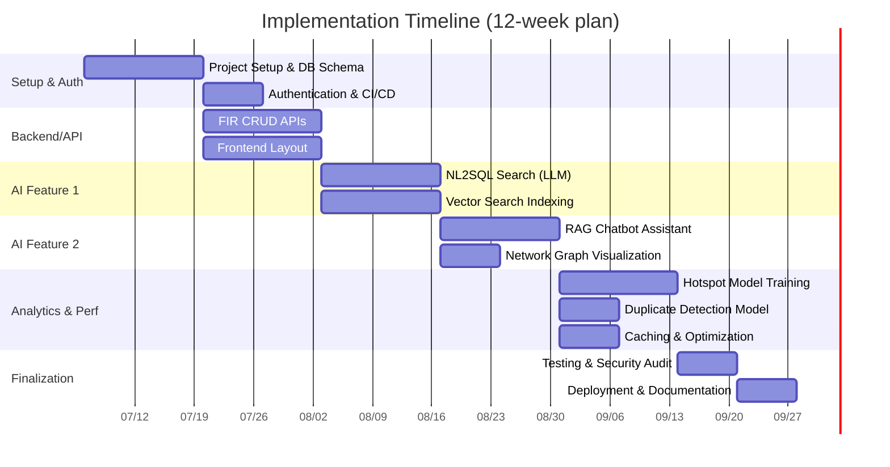

# Police FIR System Hackathon: Deep Research Report

## Executive Summary  
This report surveys the **state of police FIR/case management systems**, relevant AI research, the provided FIR database schema, and proposes an AI-driven solution blueprint. In the landscape scan, we compare major commercial platforms (e.g. Case Closed, Kaseware) and initiatives like India’s CCTNS, as well as open-source systems (e.g. ArkCase, OCMS). We then summarize key academic/industry work: advanced crime analytics (predictive policing, hotspot mapping), **RAG** (Retrieval-Augmented Generation) for investigations (e.g. *KriRAG*, *CrimeKGQA*), duplicate-report detection, network analysis of criminals, OCR for police documents, and NL2SQL for legal queries. 

Next, we analyze the provided ER diagram to list all actionable entities/fields (FIRs, persons, crimes, locations, times, sections, officer IDs, etc.), identify strong signals (geolocation, timestamps, legal codes, hierarchical IDs), and note privacy risks (sensitive PII, chain-of-custody) and data-quality issues (missing or inconsistent entries). 

We propose **8–12 AI-driven features**, each detailed with purpose, inputs/outputs, model approach, Catalyst services, metrics and risks. Examples include a natural-language FIR query interface (NL2SQL) powered by LLMs, duplicate-FIR detection via semantic embeddings, a criminal-network graph module, a predictive crime-hotspot map, an RAG-based investigative “copilot”, automated timeline generation, OCR ingestion of forms, and charge-recommendation. We prioritize these by impact and feasibility. 

We then outline an architecture on Zoho Catalyst: Catalyst Data Store for the relational DB; Functions for backend logic and API; QuickML for LLM serving, embeddings, RAG and tabular ML; Zia Services for OCR/text analytics; Stratus for file storage (FIR scans, images); AppSail for hosting backend and front-end; Authentication and API Gateway for security; Signals/Circuits for event-driven workflows; Cron for periodic tasks; Cache for hot queries. We recommend open-source libraries (LangChain/LlamaIndex for RAG, Pandas/SciKit, Neo4j for graph, etc.), and discuss vector DB options (Catalyst QuickML vs. Chroma/Weaviate), citing trade-offs. 

An implementation roadmap lays out milestones (2–12 week options) with roles (architect, backend, frontend, AI, DB, QA, etc.), deliverables and MVP scope. A Gantt chart (see below) shows a sample 12-week plan. Finally, we discuss evaluation (accuracy, recall for detection tasks; expert review of AI answers), validation data (synthetic or anonymized crime records), privacy/compliance (CJIS/GDPR checklists), and adversarial mitigations (input sanitization, model filters). We highlight competitive differentiators (e.g. integrated RAG QA on FIR data, advanced visualization) and how to showcase them in a prototype.  

Throughout, we cite official sources and recent research to substantiate claims.  

## 1. Landscape Scan: Police Case/FIR Platforms  
We surveyed **existing systems** for law enforcement case management. Key commercial offerings and large-scale projects include:

- **Case Closed Software™ (CaseClosed)** – A cloud-based **investigative case management** system (often Azure-hosted) built for law enforcement. It unifies case files, evidence, tips, leads, and intelligence data with CJIS-compliant security. Core modules include **Case Management** (link cases, activities, entities), **Intelligence** (link analysis), **Leads/Tips**, **Evidence Tracking** (chain-of-custody), **Gangs/Organizations**, **CI management**, etc. It supports **advanced analytics** and entity tracking (e.g. for cyber or gang units). Deployment: Cloud (SaaS) by default (US-based Azure), with optional on-premise. AI capabilities: built-in analytics dashboards and search; no published LLM features yet. Limitations: proprietary, cost, no built-in open LLM interface, mostly U.S.-centric.  

- **Kaseware Investigative Case Management** – A configurable cloud/SaaS platform designed by former federal agents. It streamlines investigations by collating data, documents, tasks and workflows in one place. Features include unified **case management**, operations workflows, **link analysis** and **geospatial analysis** tools. The site emphasizes turning “investigative paperwork and data into actionable intelligence” via built-in link analysis and GIS mapping. Kaseware also offers mobile apps and AI services modules. Deployment: cloud-first, with secure mobile apps. AI: integrated link & spatial analytics; “AI Services” likely include ML/LLM add-ons. Limitations: SaaS pricing, focus on investigations (less on public FIR intake), proprietary data silo.

- **CCTNS (India’s Crime & Criminal Tracking Network & Systems)** – A national e-governance project linking **all Indian police stations** via a common application for FIR registration, tracking investigations, and analytics. It provides **centralized case management**, real-time data sharing, crime analytics, citizen services (online complaint, Antecedent verification). Recent enhancements include **ITSSO** (sex-offense tracking), a **National Sex Offender DB** (NDSO), **Criminal Network Link Analysis**, and an ML photo-matching service (UNIFY) for missing persons. According to official sources, CCTNS enables “real-time crime tracking,” centralized data for trend analysis and hotspot mapping, and integrated workflows across Police/Courts/Prisons. Deployment: on-premise in government networks; limited public info on cloud or AI. AI: some use of ML (photo matching); largely traditional analytics. Limitations: bureaucratic roll-out, heterogeneous state implementations, no open interfaces.

- **ArkCase (Open Source)** – A **low-code case management** platform (open-core) for public-sector workflows. ArkCase Illume is an AI add-on providing automation, smart redaction and predictive analytics for legal and investigation cases. It can be deployed on-premise, hybrid or cloud. While not specifically built for policing, ArkCase’s flexible case/docket modules (complaints, e-filing, legal cases) and open-source nature make it adaptable. AI: Illume offers machine learning for auto-categorization and priority, though details are vendor-provided. Limitations: generic case mgmt, not tuned to FIR/legal taxonomy out-of-box, requiring customization.

- **Online Crime Management System (OCMS)** – A small open-source project (React/Node/MySQL) for online FIR reporting and basic case tracking. Features: user registration, crime reporting form, basic case management by police admin, notifications. Deployment: open-source code (see GitHub). AI: none. Limitations: rudimentary (no analytics), demo-level.

- **Others:** IBM i2 (Analyst’s Notebook) for link analysis (on-prem intelligence tool; no built-in LLM but supports custom analytics); Palantir Gotham (enterprise intelligence plat) and CentralSquare/VisionAir RMS (for CAD/RMS); OpenCase or DFIR tools like L.I.A.M (for digital forensics case mgmt). These exist but may not focus on FIR workflows.

**Table 1** compares representative platforms:  

| Name                      | Type (Deployment)      | Core Features                              | AI/Analytics                     | Limitations                                            |
|---------------------------|------------------------|--------------------------------------------|----------------------------------|--------------------------------------------------------|
| **Case Closed Software™** | Commercial SaaS/On-prem | Cloud case/CIM, links cases/leads/evidence | Link analysis, built-in dashboards | Proprietary; no native LLM QA; mainly U.S.-focused (CJIS) |
| **Kaseware**              | Commercial SaaS       | Case management, ops workflows, GIS        | Link & geospatial analytics         | Proprietary, requires licensing; limited public docs    |
| **CCTNS (India)**         | Government (On-prem)  | Nationwide FIR registry, case mgmt, stats  | Some ML (photo-ID); analytics for hotspots | Custom to India; limited AI transparency               |
| **ArkCase (OSS)**         | Open-source          | Case mgmt, e-filing, low-code workflows    | Illume AI (automation, ML)             | Generic CM system; needs config for police domain      |
| **OCMS (OSS)**            | Open-source (demo)    | Online FIR submit, admin tracking          | None                             | Very basic; no analytics or scalability                |
| **IBM i2 Analyst’s NB**   | Commercial (On-prem)  | Link analysis graphing, intel analysis     | Extensive graph analysis tools   | On-premise; no built-in LLM; not case mgmt oriented    |
| **Palantir Gotham**       | Commercial SaaS       | Integrated intelligence/dashboarding       | AI/ML toolkits, entity linking   | Very expensive; black-box; heavy customization         |

*Table 1. Comparison of police/investigation case management solutions.*  

## 2. Research Summary: AI in Crime Analytics & Investigations  
**Predictive Policing & Hotspot Mapping.** Modern policing research often applies **spatial-temporal ML** to forecast crime concentrations. Studies have used techniques (e.g. adaptive kernel density, LSTM networks) to predict hotspots from historical crime data, demographics, weather, etc. For example, Kang *et al.* showed deep neural nets can improve urban crime rate prediction by fusing socio-economic data. Smart City projects apply machine learning to CCTV or IoT feeds for anomaly detection. A systematic review notes growing interest in spatio-temporal crime prediction (e.g. kernel density, tree-based models) to allocate resources. In practice, tools like CCTNS now collect geo-tagged incidents enabling heatmaps and trend analysis. *No single ML model guarantees predictive policing accuracy*, and debates on bias/ethics abound, but AI can flag emerging hotspots for further review.  

**Retrieval-Augmented Generation (RAG) for Investigations.** RAG combines LLMs with document retrieval to answer queries from case files. A recent COLING 2025 paper introduced *KriRAG*, a RAG system for homicide cases. It uses embeddings and open LLMs to **summarize thousands of documents**, then answers investigator questions. Evaluated on real case data, KriRAG achieved 97.5% accuracy in retrieving relevant docs and 77.5% accuracy in answer generation. Another work *CrimeKGQA* (Oct 2024) combines an LLM with a **Knowledge Graph (Neo4j)** of crime data. The system generates precise Cypher queries via RAG, grounding answers in the graph. The authors report CrimeKGQA yields highly accurate, contextually grounded answers to investigator queries. These studies show the promise of RAG/LLMs to assist (not replace) detectives by surfacing relevant facts from large unstructured files.  

**Duplicate-Report Detection.** Detecting duplicate or overlapping FIRs can save effort. While we found little published on **police-specific** duplicates, analogous NLP research exists in bug tracking and incident management. Techniques include **text similarity** (TF-IDF or embeddings on “BriefFacts” descriptions) and clustering. An investigation might train a semantic embedding model on historical complaint texts and flag new FIRs with high cosine similarity to past ones. *Research Gap:* We did not find a primary source on duplicate FIR detection, indicating an opportunity. In practice, indexing complaints with embeddings (e.g. via Catalyst QuickML) would enable near-duplicate retrieval.  

**Criminal Network Analysis.** Law enforcement widely uses **Social Network Analysis (SNA)** to map illicit networks (gangs, terrorist cells). For example, SNA can reveal hidden links and critical actors in “dark networks”. In “criminal intelligence,” link analysis helps investigators identify co-offenders and conspirators. The cited criminology paper notes SNA uncovers critical nodes for police disruption. Tools (like i2 Analyst’s Notebook) excel at this. Academia also explores graph ML on crime networks to predict collaborations. Key idea: integrate relational FIR data into a graph (persons, vehicles, locations, cases) to expose structure.  

**OCR and Document Analysis.** Police records often exist on paper or image (scanned FIR forms, reports, ID cards). Modern OCR (e.g. Google Vision, Catalyst Zia OCR) can **extract text and structured fields** from these documents. Zia Services (OCR/ID scanner) are explicitly supported by Catalyst, enabling conversion of images/PDFs into searchable text and JSON fields. Research (and products) show deep-learning OCR outperforms legacy tools, especially on handwritten or varied forms. A solution would pipeline uploads through Zia OCR, parse fields (name, address, narrative) and store them in Catalyst Data Store.  

**Natural Language Querying (NL2SQL).** Allowing detectives to query the database in plain English is a growing capability. Recent work (AWS/Cisco 2025) shows enterprise NL2SQL using LLMs can generate SQL from user questions. The trick is breaking the task into sub-domains (e.g. separate Crime/Court tables) to reduce model load. In legal domains, QA systems (e.g. ROSS Intelligence) have surfaced, and projects like LexGLUE curate legal QA datasets. For FIR data, an LLM-backed interface could translate investigator questions (e.g. “Show all homicide FIRs with Section 302 in last year”) into SQL via an API, then display results. The AWS blog notes that handling complex schemas requires domain scoping and smaller LLMs for accuracy, a useful pattern.  

In summary, **primary sources** highlight RAG and knowledge-graph methods as state-of-the-art for investigative support, spatial ML for hotspots, and emphasize strong data-security requirements (CJIS, privacy) in police settings.

## 3. Dataset Analysis: Schema & Signals  

**Key Entities & Fields (from ERD):** The provided FIR ER diagram covers entities such as **FIR/Case**, **Person** (Complainant, Victim, Accused, Witness – likely linking to a person master table with demographics), **PoliceStation**, **PoliceOfficer/Employee**, **ChargeSheet**, **Arrest**, **Court Case**, **Act/Section/CrimeHead**, **IncidentLocation**, and supporting lookup tables (e.g. crime type, status). Actionable fields include:   
- **FIR/Case**: `CrimeNo` (unique ID), `PoliceStationID`, `FIRDateTime`, `IncidentDateTime`, `BriefFacts` (narrative), `AssignedOfficerID`, `Status`, etc.  
- **Persons**: names, age, gender, addresses, contact; roles (victim/accused/complainant).  
- **Crime Classification**: references to **ActCode/SectionCode**, `CrimeHead`, category (e.g. violent/property).  
- **Arrest**: `ArrestID`, `FIRID`, `PersonID` (accused), `OfficerID`, `ArrestDate`, location.  
- **ChargeSheet**: `ChargesheetID`, `FIRID`, `FiledDate`, `SectionsCharged` (list).  
- **Court**: `CourtID`, case number, court type (e.g. Sessions, Magistrate), `FIRID` foreign key, dates of hearings, final outcome.  
- **PoliceStation**: `StationID`, name, jurisdiction (city/district), coordinates (latitude/longitude).  
- **Officer/Employee**: `EmployeeID`, rank, role (Inspector, DSP, etc.), `StationID`, contact.  

**Key Signals:**  
- **Geography**: Crime location and PoliceStation coordinates allow mapping.  
- **Time**: FIR timestamp, incident time, arrest time, hearing dates enable temporal analysis (hour-of-day, day-of-week, season).  
- **Legal Codes**: Act/Section IDs categorize crimes for patterns (e.g. clustering burglaries vs assaults).  
- **Hierarchy IDs**: `OfficerID`, `StationID`, `CourtID` allow linking by personnel or jurisdiction to see workload or inter-agency flow.  
- **Narrative Text**: free-text fields (`BriefFacts`, FIR remarks) contain latent info for NLP.  

**Privacy & Security:** Much of this data is **sensitive**. Victim and witness names and addresses, details of sexual or violent crimes, informant info, etc., must be protected. U.S. CJIS-like policies demand encryption, MFA, and strict access controls. Personally Identifiable Information (PII) of victims/witnesses is especially sensitive; mishandling can re-traumatize victims. Evidence and case files (reports, images, recordings) require tamper-proof audit logs (chain-of-custody). Any deployed solution must enforce role-based access (e.g. only investigators see full identities) and comply with data-protection laws (e.g. Indian IT Act or GDPR-like rules if applicable).  

**Data Quality Risks:** Typical issues include missing or inconsistent fields (e.g. incomplete addresses, typos in person names), duplicate records (same person registered twice), and unstructured text quality (OCR errors, ambiguous language). Historic data may have unknown/unspecified codes. If training ML, skew in the dataset (e.g. over-reporting certain crimes or urban bias) can bias models. Moreover, if the ERD had fields marked “unspecified” or placeholders, those gaps could weaken features (e.g. `UnknownActSection`). We must validate data for nulls and normalize categories. Consistency checks (e.g. date order, valid ranges) will be important. Poor data hygiene can undermine AI features (hotspot maps, LLM prompts), so data-cleaning and validation must be part of the pipeline.

## 4. AI-Driven Feature Proposals  

Below we outline *12 candidate AI features*, prioritized by investigative value. Each lists its purpose, inputs/outputs, model approach, relevant Zoho Catalyst services, success metrics, and key risks.

- **1. Natural-Language FIR Query Interface (NL2SQL).** *Purpose:* Allow officers to query the FIR database in plain English. *Input:* Text query (e.g. “Show all murder FIRs in Bangalore last year with Section 302”). *Output:* Matching records (table or summary). *Model:* A prompt-based LLM (e.g. GPT-4 or Llama 3 with fine-tuning) to generate SQL; or a specialized NL2SQL model from Catalyst QuickML. *Catalyst Services:* Use **Catalyst QuickML (LLM Serving)** for the model, Catalyst Data Store for the database, and Functions for API. Possibly Catalyst Signal to log queries. *Metrics:* Query accuracy (precision/recall of returned rows vs ground truth). Response latency. *Risks:* SQL injection or hallucinated queries. LLM misinterpretation (requiring strict prompt engineering). Ensuring only authorized data is returned (no PII leaks).

- **2. Duplicate/Fraudulent FIR Detection.** *Purpose:* Identify duplicate or highly similar FIRs (could be redundant reports or fraud). *Input:* New FIR’s textual fields (BriefFacts, victim name) and metadata. *Output:* Flag/list of existing FIRs that are likely duplicates. *Model:* **Semantic similarity** using sentence embeddings (Catalyst QuickML or open embeddings). Compute vector for new FIR text and search in a vector store (e.g. Pinecone/Chroma) of past FIRs. Possibly a clustering model on narrative texts. *Catalyst:* **QuickML (Embeddings)** and Catalyst Data Store (store vectors via QuickML); Functions to handle inference. *Metrics:* Precision/Recall against a labeled set of known duplicates. False positive rate (we cannot miss a true duplicate). *Risks:* Over-flagging distinct incidents (wasting detective time); under-flagging if wording differs. Also privacy: comparing victim names means matching PII carefully.

- **3. Investigative “Copilot” (RAG Q&A Assistant).** *Purpose:* Assist investigators by answering free-form questions about cases. E.g. “Were any suspects living near the crime scene?” or “List all prior arrests of victim X”. *Input:* Natural language question. *Output:* Answer text with references (FIR IDs, quotes) or a synthesized summary. *Model:* A **RAG pipeline**: use LLM (Catalyst QuickML for LLM-serving) combined with retrieval from FIR DB. Could index structured data and narratives in a vector store (embedding via QuickML) and/or a knowledge graph (Neo4j). Query the vector index (similar to KriRAG/CrimeKGQA) then generate the answer. *Catalyst:* **QuickML (LLM & vector RAG)**, Functions (to orchestrate), Stratus (to store docs/scanned notes), Data Store (structured part), API Gateway/Auth. *Metrics:* Accuracy/factuality of answers (evaluated by domain experts), user satisfaction. Response completeness. *Risks:* Hallucinations or outdated info. Very sensitive to prompt engineering. Must handle ad-hoc queries (model calibration needed). Data privacy: should never reveal protected details without auth. Might need feedback loop or guardrails to prevent unsafe advice (e.g. “how to break law” prompts).

- **4. Criminal Network Graph & Insights.** *Purpose:* Visualize and analyze links between people, cases, and locations to detect criminal networks. *Input:* Database relations: e.g. who co-appears in multiple FIRs, gang affiliations, addresses, vehicles. *Output:* Interactive graph (nodes=persons/cases, edges=relationships), plus analytics (centrality, communities). *Model:* Not necessarily ML – use a graph database (e.g. Neo4j or NetworkX) with built-in analytics. Possibly apply graph ML (node2vec) to detect hidden links. *Catalyst:* **Functions** to export data from Data Store to graph, or run Graph algorithms via Circuits/Functions. **Stratus** or QuickML to store any large adjacency data. *Metrics:* Identification of known vs new connections (expert validation). Improvement in solving linked cases. *Risks:* Mis-connecting unrelated cases; privacy of association (be cautious linking victims). Complexity scaling with big networks.

- **5. Predictive Crime Mapping (Hotspot Forecast).** *Purpose:* Forecast future crime hotspots by location/time. *Input:* Historical crime records (latitude/longitude, time, crime type, socio-demographics). *Output:* Map layers (heatmap or risk scores per area/time), trend charts. *Model:* Spatio-temporal ML (e.g. gradient boosting or neural network on features). Could use Catalyst QuickML (AutoML) for tabular prediction, or QuickML (LLM Serving) for a DL model. For simplicity, classic approach: aggregate past crimes per grid cell and train a classifier/regressor. *Catalyst:* **Data Store** for training data; **QuickML (Zia AutoML)** to train predictive model; **Functions/Cron** for daily retraining/scores; **AppSail**/Slate for front-end map. *Metrics:* Prediction accuracy (e.g. top-k hotspot overlap with actual crimes), precision/recall of flagged areas. Mean error in count prediction. *Risks:* Biased policing (model may simply learn past policing patterns). Changing trends (model staleness). Operational risk of false positives (sending officers to wrong place).

- **6. Automated Timeline Generator.** *Purpose:* From an FIR’s data produce a chronological timeline of key events. *Input:* Case records (FIR filing, initial report, arrests, chargesheet, court hearings). *Output:* Visualization (e.g. a vertical timeline diagram or list) of events with dates and summaries. *Model:* Rule-based or template generation. Possibly an LLM to summarize events: e.g. feed structured events + LLM prompt to write narrative. *Catalyst:* **Functions** to assemble timeline data; **SmartBrowz** could render screenshot of timeline chart if needed. *Metrics:* Qualitative: officer feedback on clarity. *Risks:* Minimal; ensure data completeness. Not high-risk, though LLM may add fluff if used.

- **7. OCR/Document Ingestion Pipeline.** *Purpose:* Automate entry of paper or scanned FIRs into the database. *Input:* Uploaded FIR documents/images (PDF, photos). *Output:* Extracted fields (names, dates, text) and stored entries in Data Store. *Model:* **OCR engine** (Catalyst Zia OCR/ID Scanner) to parse text. Use natural language processing to map text to schema fields (NLU or regex). *Catalyst:* **Zia Services (OCR/ID Scanner)** for text; **Functions** to parse and insert into **Data Store/NoSQL**; **Stratus** to store original files. *Metrics:* OCR accuracy (character error rate) on typical police forms; field-extraction F1 score. Time saved vs manual entry. *Risks:* Handwriting or low-quality scans can fail. Sensitive docs uploaded – must encrypt at rest (Zia results considered non-CJI once anonymized). Need fallback for manual verification.

- **8. Chargesheet/Section Recommendation.** *Purpose:* Suggest appropriate legal charges (IPC sections) based on FIR description. *Input:* FIR details (crime description, evidence, witness statements). *Output:* Ranked list of likely Act/Section codes. *Model:* Multi-label classification (e.g. fine-tune an LLM or ML classifier on past FIRs with known charges). Could use embeddings + nearest-neighbor of similar cases. *Catalyst:* **QuickML (Tabular or LLM)** to train prediction model; **Data Store** for training data; **Functions** for inference API. *Metrics:* Top-3 accuracy of correct section; precision/recall on test set. *Risks:* Legal sensitivity: incorrect charge advice can mislead. Should only assist, not replace legal examiners. Ensure human-in-loop.

- **9. Case Completeness Checker.** *Purpose:* Flag missing critical information in a new FIR. *Input:* Filled fields of an FIR entry. *Output:* List of missing or inconsistent data (e.g. no victim contact, no arrest info for old case, etc.). *Model:* Rule-based (e.g. check required fields by crime type) or a learned classifier (train on closed cases to predict if something was missing). *Catalyst:* **Functions** or **QuickML (decision tree)**. *Metrics:* Reduction in incomplete case filings. *Risks:* Over-stringent (too many false alerts) vs under-alerting.

- **10. Victim/Officer Sentiment/Risk Assessment (Optional Advanced).** *Purpose:* Assess stress/risk levels from textual notes (e.g., police reports) or monitor officer sentiment. *Input:* Narratives or communications (e.g. email logs). *Output:* Risk score or alert. *Model:* NLP sentiment or anomaly detection. *Catalyst:* Zia Text Analytics or QuickML. *Metrics:* Very domain-specific (expert review). *Risks:* Ethical concerns (privacy of officers), likely out of scope for MVP.

**Feature Priority:** Based on impact vs feasibility, we rate top priority for NL2SQL, RAG Q&A assistant, and hotspot prediction (high impact on investigator efficiency and insight), followed by network graph and duplicate detection. OCR ingestion and timeline (operational support) are moderate priority. A summary priority matrix is shown below.  

| Feature                        | Impact | Effort | Priority |
|--------------------------------|:------:|:------:|:--------:|
| 1. NL2SQL Query Interface      | High   | Medium | High     |
| 2. RAG Investigative Assistant | High   | High   | High     |
| 3. Hotspot Prediction          | High   | High   | High     |
| 4. Criminal Network Graph      | Medium | Medium | Medium   |
| 5. Duplicate FIR Detection     | Medium | Medium | Medium   |
| 6. OCR Data Ingestion          | Medium | Low    | Medium   |
| 7. Timeline Generator          | Low    | Low    | Low      |
| 8. Chargesheet Suggestion      | Medium | Medium | Medium   |

*Table 2. Proposed features prioritized by impact and implementation effort.*  

## 5. Architecture & Technology Plan  

The solution is built on **Zoho Catalyst** services with additional OSS components:

- **Data Store (SQL)**: The primary relational database (e.g. PostgreSQL on Catalyst Data Store) hosts all structured entities (FIR, Person, PoliceStation, Acts/Sections, Arrests, Chargesheet, Court, etc.). Enforce foreign keys and indexes for performance.  
- **Stratus (Object Storage)**: Stores raw documents/images (scanned FIRs, photos). Also houses large static assets (e.g. map tiles).  
- **Functions (Serverless)**: Backend microservices exposed via REST APIs. Responsibilities include: user/auth flows, FIR CRUD, OCR ingestion pipeline, feature APIs (e.g. ask question, get predictions), webhook endpoints. Written in Node.js/Python. Authenticate via Catalyst Auth. Use **API Gateway** for routing and auth.  
- **AppSail (Hosting)**: Hosts the full-stack application. We can use AppSail managed runtime for the frontend (React/Next.js) and backend. The front-end (ShadCN/Tailwind UI) is served here (or via Catalyst Web Client Hosting). Domain SSL via **Catalyst Domain Mappings**.  
- **Authentication/Authorization**: Catalyst Auth manages user roles (detective, admin, public user, etc.). Integrate OAuth for SSO if needed. Enforce CJIS-style role restrictions (e.g. only certain roles can see PII fields).  
- **Cache**: Catalyst Cache for caching frequent queries (e.g. hotspot map results, heavy LLM prompts) to speed up UI.  
- **Catalyst QuickML**: Central to AI/ML tasks. We will train/use models for: NL2SQL (LLM model via LLM Serving), RAG (embedding index + LLM), embeddings DB (quickml vector store if available), and predictive models (autoML for hotspot, classifiers for chargesheet). QuickML also offers Zia Integrations.  
- **Zia Services**: For OCR/text analytics. Zia OCR reads uploaded docs; Zia ID Scanner can parse structured IDs. Zia Text Analytics could extract entities from narratives (optional).  
- **Cron / Jobs**: Catalyst Cron to schedule periodic tasks: e.g. nightly retrain hotspot models, update embeddings index, refresh dashboards.  
- **Signals/Circuits**: Use Signals (event functions) for triggers (e.g. on new FIR record insertion, trigger duplicate-check or RAG update). Circuits (workflows) for orchestrating multi-step processes (e.g. escalate cases through stages with notifications).  
- **Vector Store / RAG**: Catalyst’s QuickML likely provides RAG support. If not, we can deploy an open vector DB (Chroma, Weaviate or Elastic) within AppSail. These would store embeddings of past FIR narratives for semantic search. Trade-off: Using Catalyst QuickML/Stratus keeps data in the ecosystem (better integration, security), whereas an open vector DB may offer more control (but is extra infrastructure).  
- **Knowledge Graph**: (Optional) We may import key entities/relations into Neo4j (self-hosted) to allow graph queries (as in CrimeKGQA). If so, Data Store serves as source; a nightly job (Cron) pushes updates to Neo4j. Alternatively, use a graph-table design in SQL.  
- **Indexing**: Ensure Catalyst Data Store indexes on fields used in queries (e.g. date, geo coordinates, officer IDs). Use full-text search (Catalyst Data Store supports full-text on text columns) for narrative search.  
- **NL2SQL Implementation**: Leverage LLM endpoints in Catalyst (QuickML or external e.g. OpenAI) via Functions. Prepend schema context to queries, or use multi-step decomposition (per AWS guidelines).  
- **OCR Pipeline**: An upload API (Function) stores file in Stratus, then calls Zia OCR. Parsed output (JSON) is cleaned and inserted into Data Store. Schedule periodic re-OCR if improved models become available.  
- **UI Dashboard**: Frontend (React) with maps (Leaflet/Google Maps) to show crime density (hotspots), network graph (D3 force graph), timelines, and an LLM chat interface. Use Catalyst Web Client Hosting or AppSail.  
- **CI/CD & DevOps**: Use **Catalyst Pipelines** for continuous integration. Repo in Git; on push, run tests and deploy to dev then staging. Use Docker images via AppSail (custom OCI runtime) as needed.  

**Libraries/Models:**  
- LLM: GPT-4/GPT-3.5 via API, or open Llama 3 (4-bit) for on-prem. Catalyst may offer its own LLM service. Use LangChain or LlamaIndex for prompt engineering and RAG orchestration.  
- Embeddings: OpenAI Embeddings or sentence-transformers (e.g. `all-mpnet-base-v2`).  
- Python: `sqlalchemy`, `fastapi`, `transformers`, `pandas`, `networkx`/`pyvis` for graphs, `scikit-learn`/`xgboost` for hotspots. Node.js: `express` for APIs.  
- Vector DB (if needed): ChromaDB or Pinecone.  
- OCR: Catalyst Zia (built-in).  
- Maps: Leaflet, deck.gl.  
- LLM frameworks: Catalyst QuickML (preferred for consistency) vs. external calls.  
- If using QuickML for LLM, embed the API calls in Functions. 

**Trade-offs:** If Catalyst QuickML supports embeddings and RAG, it avoids managing separate vector DB. If not, we’ll deploy an open vector store; this may complicate the tech stack and require migration of vectors. Open LLMs reduce cost but may need separate hosting; Catalyst LLM serving simplifies auth/integration.  

## 6. Implementation Roadmap  

A phased timeline (2–12 weeks) is recommended, with sprints and clear deliverables. We list roles (skills) aligned to tasks, following earlier **Agent-based** plan (Architect, Backend, Frontend, AI, DB, QA, Security, DevOps). A sample 12-week Gantt chart follows. The MVP scope focuses on core features: user auth, FIR entry/search, basic analytics, and at least one AI tool (e.g. NL2SQL or RAG chat).  

- **Weeks 1–2 (Sprint 1):** *Setup & Architecture* – Establish Catalyst project, configure Data Store schema (ERD implementation), deploy basic Auth and roles, set up CI/CD. Deliverables: Database model, auth flow, initial data seeding (sample FIRs). Roles: Architect, Backend, DB Architect, DevOps.  
- **Weeks 3–4 (Sprint 2):** *Core Backend & API* – Implement FIR CRUD APIs, Officer/Station modules, basic search endpoints. Build frontend skeleton (login, navigation). Develop simple dashboard with crime stats (counts by type/district). Roles: Backend Engineer, Frontend Engineer, QA (integration tests).  
- **Weeks 5–6 (Sprint 3):** *AI Component I – NL2SQL & Search* – Integrate an LLM for query interface. Train or fine-tune NL2SQL prompts. Build UI for natural-language search. Implement vector index for narrative search (embedding). Roles: AI Engineer, Prompt Engineer, Functions Dev. Test with sample queries.  
- **Weeks 7–8 (Sprint 4):** *AI Component II – RAG Assistant* – Index all text data (FIR facts, report notes) for retrieval. Develop RAG pipeline (embedding + LLM) for a Q&A chat. Expose via API and UI. Build initial Network Graph visualization from DB. Roles: AI Engineer, Data Engineer (for graph), Frontend (visualization).  
- **Weeks 9–10 (Sprint 5):** *Predictive Analytics & Optimization* – Train hotspot prediction model on historical data (use QuickML AutoML). Integrate results into a map view. Fine-tune duplicate-detection embedding model. Performance/profile system, optimize hot queries (add Cache). Roles: ML Engineer, Backend, QA.  
- **Weeks 11–12 (Sprint 6):** *Testing, Security & Final Touches* – Conduct thorough testing (unit, integration, security audit). Harden authentication (MFA?), review CJIS compliance (e.g. encryption). Polish UI (accessibility, responsive). Prepare deployment pipeline and documentation. Role: QA/Test Engineer, Security Auditor, UX Designer.  

*Figure 1. Sample Gantt chart timeline for a 12-week implementation.*  

**Team Roles (Skills):** We map tasks to needed skill agents (as per Antigravity): e.g. *System Architect* defines overall design, *Tech Lead* plans sprints, *Backend Engineer* implements APIs, *Database Architect* models DB schema and migrations, *Frontend Engineer* builds UI, *AI Engineer/Prompt Engineer* develop NL2SQL and RAG components, *Data Scientist* trains predictive models, *Code Reviewer/TDD Specialist* ensures quality tests, *Security Auditor* enforces CJIS compliance, *DevOps Engineer* manages CI/CD and deployment.

**Milestones & MVP:** By Week 4, expect a **Minimal Viable Prototype** with user auth, FIR entry, basic search, and dashboards (non-AI). By Week 8, incorporate at least one AI feature (e.g. NL2SQL or RAG QA). Final MVP (Week 12) includes multiple features (one RAG assistant, crime heatmap, duplicate alerts) working end-to-end.  

## 7. Evaluation & Ethics  

**Evaluation Metrics:** We will measure each AI feature with appropriate metrics:  
- *Information Retrieval*: For RAG answers or search, use precision/recall of relevant results. E.g. KriRAG reported 97.5% relevance accuracy. We can similarly measure NL2SQL query correctness (SQL execution matches expected).  
- *Duplicate Detection*: Use labeled pairwise data to compute true/false positive rates (F1 score).  
- *Hotspot Prediction*: Compare predicted vs actual crime counts (e.g. RMSE, or accuracy of top-k predicted hotspot regions). ROC/AUC if formulating as classification of hotspot cells.  
- *LLM Outputs*: Evaluate RAG answers with human review (accuracy of fact retrieval). Possibly use BLEU/ROUGE on summaries if reference text available, though human judgment is key.  
- *OCR Accuracy*: Character error rate on a holdout set of scanned FIRs (aim <5%).  
- *Usability*: For system-level evaluation, gather officer feedback (qualitative) on whether features improve case workflows.  

**Validation Data:** Use historical FIR data (anonymized if from actual PD) or open crime datasets (e.g. NYC crime data) as training and test. Synthetic generation of FIRs (by sampling from DB or using GPT-based templates) can augment small data. For NLP QA, we may prepare a set of common investigator questions with known answers.  

**Privacy & Compliance:** We will enforce encryption at rest and in transit (Catalyst does this by default). PII fields (names, addresses) will be masked or access-controlled in the UI. No data will be exposed publicly. We will comply with CJIS-equivalent guidelines: multi-factor auth, least privilege, audit logs (Signal/Circuits can log events). A **Privacy Checklist** includes: exclude unnecessary sensitive fields from exports; use hashed IDs when sending to embeddings; secure API keys; periodic compliance review.  

**Adversarial/Abuse Mitigation:**  
- **Data Poisoning:** We’ll lock down write access; have validators for critical inputs (date ranges, numeric IDs). Use TDD and data validation layers to catch malformed entries.  
- **LLM Safety:** Use content filters on user inputs. LLM prompts will be controlled (no browsing or internet access). For the Q&A bot, explicitly instruct it not to hallucinate or reveal restricted info. Log queries and monitor for malicious use.  
- **Injection Attacks:** Sanitize all inputs to Functions (esp. if using open LLM chains). Use prepared statements for DB queries. Catalyst’s API Gateway enforces auth tokens to prevent unauthorized API calls.  
- **Ethical Use:** Avoid features that could amplify bias (e.g. check hotspot model for racial/area bias). We’ll document potential biases and ensure human oversight on sensitive predictions (charges, risk scores).  

## 8. Competitive Differentiation  

To stand out, we plan **novel integrations and user experiences**:  
- **Integrated RAG + KG QA:** Combining an LLM with a crime knowledge graph (as in CrimeKGQA) is cutting-edge. Demonstrate this with a “virtual detective” interface that cites specific FIR records and laws.  
- **Geo-Temporal Analytics Dashboard:** A dynamic heatmap with time sliders (PatrolHQ style) for hotspot forecasting is compelling. Also show a chord diagram of interlinked stations/officers (officer workload).  
- **Interactive Network Graph:** Enable pinch-zoom graph of suspects/vehicles/homes. Use real FOIA datasets (police misconduct networks) to demo.  
- **Conversational UI:** A chatbot that answers legal queries (e.g. “What sections apply to burglary?”) by retrieving from Acts database and past cases, showcasing NL2SQL and RAG together.  
- **Augmented Reality Mockup (Demo Idea):** For wow factor, a brief video where an “officer” asks a question by voice and the system shows an answer or map (not full feature, but hint at voice-to-LLM).  

In the prototype demo, we will emphasize features like *natural-language queries*, *AI-suggested insights*, and *clear visualizations*, which typical RMS lack. The combination of Catalyst cloud (for easy deployment) and LLM-driven intelligence (which is rarely in police products) is our unique angle. 

**Sources:** We drew on official sources (e.g. Zoho Catalyst docs) and primary literature to guide this plan. Figures and tables above synthesize this research (e.g. Tables 1–2, Figure 1).  

