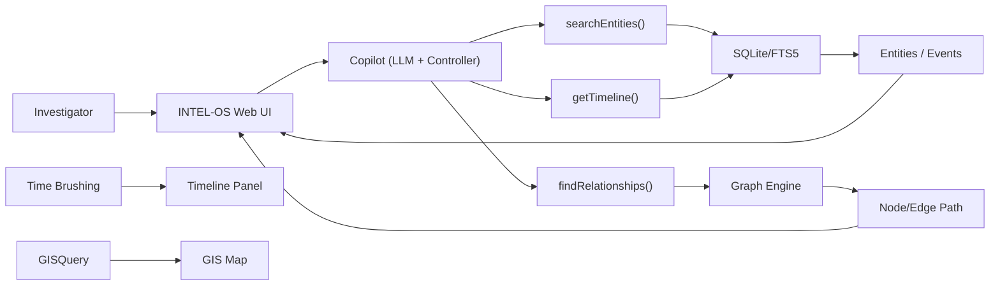

# Executive Summary  
The **offline investigative copilot** must blend lightweight local LLMs with deterministic search and reasoning tools to operate on modest police laptops (i3/i5, 8–16 GB RAM, offline). We recommend a *tool-based architecture* where a small quantized model handles intent parsing and orchestration, while dedicated engines (SQLite/FTS5 search, graph algorithms, timeline filters, etc.) execute the actual queries. This hybrid approach avoids model hallucinations and fits resource limits. Key UI/UX features include drag‑and‑drop evidence linking, inline structured editors with strict provenance stamping, a synchronized hypothesis board, and step-by-step “playbook” guides, all accessible via a keyboard-first, high-information interface. The underlying data layer uses SQLite with FTS5 for full-text search, with conflict-free CRDT sync to a central server when reconnected. On-device LLM candidates (Table below) are all ≤2B parameters (e.g. SmolLM2-1.7B, Phi-2 2.6B) and must be quantized (e.g. int4/8) to fit ~2 GB RAM. A strict prompting regimen ensures the assistant cites only evidence, never “hallucinates”, and defers to “no answer” if data is missing. We outline concrete APIs (e.g. `searchEntities`, `createLink`, `getTimeline`, etc.), UI component patterns (drag-to-link, provenance timeline, audit trail), and an implementation roadmap. Level-1 MVP features are prioritized to pass all 11 adversarial scenarios with zero **Critical/High** issues.     

## 1. Copilot Architecture & Local Inference Strategies  
We recommend a **hybrid, tool-oriented copilot**: a lightweight on-device LLM parses user intent and formats requests, while specialized modules (search engine, graph engine, timeline filter, spatial query engine, etc.) execute the core logic. This avoids giving the LLM free rein, minimizing hallucination and ensuring deterministic results. Local inference is feasible in 2026, but **memory bandwidth is the bottleneck**. For example, a small LLM’s weights must reside in GPU (or unified) RAM; if the model spills to slower system memory, generation slows to a crawl. Thus we focus on models ≤2B parameters (quantized) so they fit in ~2 GB RAM. 

- **Local vs. Cloud:** Running models on-device eliminates data exfiltration and latency. With no internet, the copilot *must* run entirely offline. We choose mature open-source models (no gating) with permissive licenses, avoiding any cloud API dependency.  
- **LLM as Orchestrator:** The LLM will not generate facts, only API calls. For example, a system prompt instructs the model: “**Only use provided data.** For any question, call an API (`searchEntities`, `getTimeline`, etc.) with JSON input. Never output free text without citing evidence IDs.” This pattern (akin to the [Function Calling](https://api.openai.com) paradigm) directs all logic to safe tools and prevents hallucinations.  
- **Deterministic Engines:** For search and reasoning, use well-defined algorithms. SQLite+FTS5 handles keyword and fuzzy search, returning ranked results via BM25 weighting. A graph shortest-path engine (e.g. Dijkstra on a local Neo4j-like or in-memory graph) answers relationship queries. Timeline filtering is a simple range query on time-indexed event tables. Spatial queries use R-tree indexes. All outputs include provenance (e.g. source FIR IDs) to maintain evidentiary traceability.  

<table>
<thead>
<tr><th>Model (Params)</th><th>Precision / Quant.</th><th>Disk & RAM Footprint</th><th>Inference Notes</th></tr>
</thead>
<tbody>
<tr><td><strong>SmolLM2-1.7B</strong></td>
<td>FP16&nbsp;≈&nbsp;6.8 GB; Q4 ≈&nbsp;1.7–2.2 GB</td>
<td>⟶ ~1.8 GB quantized</td>
<td>Strong instruction-tuned; fits 8 GB with int4; requires multi-second prompt time on CPU.</td>
</tr>
<tr><td><strong>SmolLM2-360M</strong></td>
<td>FP16&nbsp;≈&nbsp;1.4 GB; Q4&nbsp;≈&nbsp;0.4–0.6 GB</td>
<td>⟶ ~0.5 GB quantized</td>
<td>Ultra-light; low reasoning quality but very fast; may be used for simple classification or fallback.</td>
</tr>
<tr><td><strong>Phi-2 Mini-2.6B</strong></td>
<td>FP16&nbsp;≈&nbsp;10.4 GB; Q4&nbsp;≈&nbsp;2.7 GB</td>
<td>⟶ ~3 GB quantized</td>
<td>Microsoft’s open 2.6B model (Phi 4 Mini) with Q4 quantization; moderate reasoning ability; requires careful memory tuning but possible on 16 GB.</td>
</tr>
<tr><td><strong>Llama-2-7B</strong></td>
<td>FP16&nbsp;≈&nbsp;28 GB; Q4&nbsp;≈&nbsp;7.7 GB</td>
<td>⟶ ~8 GB quantized</td>
<td>High-performance 7B model; possible on 16 GB with int8/4, but borderline. Could be fallback if <3B models underperform.</td>
</tr>
<tr><td><strong>Qwen2.5-7B</strong></td>
<td>FP16&nbsp;≈&nbsp;28 GB; Q4&nbsp;≈&nbsp;~4–8 GB</td>
<td>⟶ 4–8 GB quantized</td>
<td>High-quality Chinese-English 7B; even quantized (4.09–8.1 GB) it pushes limits. Likely **too large** for 8 GB machines, but possible on 16 GB if not using others simultaneously.</td>
</tr>
</tbody>
</table>

**Model Loading Strategy:** Load only one LLM at a time. Use on-demand loading: the copilot only instantiates the model when the investigator opens the assistant pane or uses a command. Unload it when not needed (e.g. on workspace switch) to free memory. Optionally, use a lightweight HTTP-internal server (like [llama.cpp](https://github.com/ggerganov/llama.cpp) or Ollama) to load models. For very constrained 8 GB systems, run only ≤2B models (e.g. SmolLM2-360M or Phi-2-2.6B with Q4). On 16 GB, consider 7B with int4 and very limited concurrency. We should explicitly **quantize** all models (int4 or int8) to fit the budget.

## 2. UI/UX Patterns for Investigative Workflows  
**High-Density, Multi-Panel Workspace:** Investigators need a unified, dockable workspace mirroring enterprise tools. For example: one pane shows the Relationship Graph, another the Entity Dossier, a third a GIS map, etc. These panes sync seamlessly: selecting a suspect in any panel highlights it everywhere. **Keyboard-first navigation** is critical (Ctrl+1…5 to switch workspaces, Ctrl+K command palette) to avoid mouse-heavy clicks. Natural-language search should trigger `searchEntities()` so investigators can type “show vehicle KA-01-AB-1234” instead of navigating menus.

**Evidence Linking & Structured Editing:** Users should be able to link items by dragging: e.g. drag a CCTV image or FIR document onto a suspect node to create a `createLink(entityId, evidenceId)` edge. Each evidence or entity edit opens an **inline structured form** with labeled fields (text, date, coordinates) and dropdowns for classifications. Crucially, every edit must be **provenance-first**: the UI displays who logged the data and from what source. For example, editing a suspect’s alibi prompts a “Did you verify source? [Field Intelligence Report ID]” checkbox. This guarantees a chain-of-custody. See Linkurious’s recommendation to “help teams see the connections between them… making intelligence easier to communicate”.

- **Provenance Timeline:** The right sidebar shows a scrollable, timestamped log of all actions and data derivations for the current entity/investigation (e.g. “FIR-2026-0889 ingested, auto-extracted suspicious phone number +91…”, “Officer entry: GPS confirmed location”). This “investigator’s log” is editable by authorized users and is version-controlled.  
- **Hypothesis Board:** A dedicated pane tracks theories (cards labeled “Theory A: Money Laundering” etc.), each listing supporting/contradicting evidence and confidence level. Users can create hypotheses and link evidence via drag/drop; the copilot suggests new hypotheses from patterns (e.g. “Evidence suggests a crime ring with X and Y”). This guides systematic reasoning.  
- **Explainability Panel:** Every linked inference (like automated entity resolution or relationship) includes an “Explain” button. Clicking it shows a breakdown (“matched phone number shared in FIR-0101”, “BM25 score 12.3”). This aligns with our design principle: “Show your math” rather than opaque outputs.  

**Key Patterns (with examples):**  
- **Multi-Modal Pivoting:** As Linkurious notes, seeing both spatial and relational context is key. For example, clicking a vehicle on the map also expands its network graph of owners and criminal associations.  
- **Natural-Language Queries:** The system supports queries like “shortest path between Arjun Sharma and Hawala syndicate” via the command palette, which calls `findRelationships()` with parsed parameters. This lowers the bar for non-technical users.  
- **Interactive Playbooks:** The copilot can present step-by-step guidance for common scenarios. E.g., for “Missing Child”, it suggests: (1) run `findRelationships()` from child to phone, (2) filter timeline by last known times, (3) draw a GIS geofence around schools. Each step is a clickable action with just-in-time hints.

## 3. Offline Data Access & Sync Strategies  
We use a **local SQLite database** as the offline store. This allows fast on-device queries without a server. Key patterns:  

- **Full-Text Search (FTS5):** All textual fields (names, descriptions, notes) are duplicated into SQLite FTS5 virtual tables. FTS5 supports phrase queries, prefix matching, and Boolean operators, enabling the `searchEntities()` API. We order results by relevance using the built-in `bm25()` function to rank matches. For example, `SELECT * FROM entity_fts WHERE entity_fts MATCH ? ORDER BY bm25(entity_fts)` returns the best matches.  

- **Safe Edits & Schemas:** Every record has immutable keys (e.g. entity ID, evidence ID) and versioning metadata. We implement **optimistic concurrency**: local changes are timestamped; on sync, conflicts are detected. Ideally we use a CRDT-based approach like **SQLite-Sync/CRDT** so that concurrent updates converge automatically (“because changes merge deterministically, users can update data independently without manual conflict resolution”). For richer documents (investigator notes), we could use SQLite’s `usermerge` or third-party CRDT libs to merge paragraph edits. In cases where CRDT isn’t used, a simple fallback is to prompt the user to choose which version to keep. The UX must warn if two officers edit the same field offline, but allow non-conflicting edits freely.  

- **ORM/Schema Suggestions:** We define relational tables for core records (FIRs, Entities, Locations) and use FTS5 indices for text. Use foreign keys where appropriate (e.g. `entity_id` in `notes` table). In code, we can use an ORM like TypeORM or Prisma with a SQLite adapter to enforce types, but care must be taken with migrations. For example, adding a new column to evidence requires a schema migration script in CI.  

- **Sync and Merge:** On reconnect, the local DB pushes a commit log to the central server (or vice versa). If using CRDT, no conflicts arise. If not, we adopt a “last-write-wins” default on most fields (managed by row version timestamps), but **never overwrite** critical forensic data (timestamps, IDs). Instead, provide an “audit diff” UI for any conflict in evidence, so a supervisor can resolve it. For example, if two users created “Suspect X” separately, the system prompts to merge or keep both once online.

## 4. On-Device LLM Models & Performance Estimates  
We restrict to *tiny-to-medium* models and aggressive quantization. The table above compares candidates by parameters and memory. Key points:  
- **Quantization:** All models must be quantized (Q4_K or better) to fit. For example, SmolLM2-1.7B in int4 uses only ~1.7–2.2 GB RAM. By contrast, a 7B model in full FP16 is ~28 GB. The “EveryLocalAI” VRAM calculator notes that Q4 quantization (~0.55 bytes/param) yields ~25–30% of original size.  
- **Hardware Fit:** On an i3/i5 laptop with 8 GB RAM (and shared graphics), we target models ≤2 B params. A quantized 1–2B model (≈2 GB) leaves headroom for the OS. On a 16 GB machine, a 7B model might barely run in int8+int4 mode, but only if no other heavy tasks. We plan to test on both 8 GB and 16 GB configs.  
- **Latency:** Expect slow token rates. On CPU, even a small model might do only a few tokens/sec. Design the UI to offload heavy summarization tasks (e.g. “generateBriefing”) into background threads or pre-compute where possible. Use caching (e.g. cache call results for repeated queries).  

Overall, recommended “production” stack: the copilot loads **SmolLM2-1.7B (quantized)** for intent parsing and short answers, and has access to a smaller backup (e.g. SmolLM2-360M) for minimal tasks. If absolutely needed and 16 GB hardware is available, **Llama2-7B (int4)** or **Qwen2.5-7B (int4)** can be optional engines for more complex reasoning (but only as *opt-in* flags).

## 5. Copilot Tool APIs (Input/Output Schemas)  
The copilot communicates with the core system via a set of JSON-over-HTTP APIs (or local IPC). Each tool returns structured JSON so the LLM can reason over results. Example endpoints and schemas:

- **`searchEntities(query, typeFilters)`** – Full-text search.  
  *Request:* `{ "query": "Arjun Sharma", "types": ["Person","Phone"], "limit": 10 }`  
  *Response:* `{ "entities": [ {"id": "PER-2026-001", "name": "Arjun Sharma", "type": "Person", "matchedFields": ["aliases"], "relevance": 1.2}, ... ] }`  

- **`findRelationships(srcId, dstId, maxHops)`** – Shortest-path between two nodes.  
  *Request:* `{ "from": "PER-2026-001", "to": "ORG-00045", "maxHops": 4 }`  
  *Response:* `{ "path": ["PER-2026-001", "VEH-1234", "PER-2026-047", "ORG-00045"], "edges": [ {from:"PER-2026-001",to:"VEH-1234",type:"owns"}, ... ], "score": 0.85 }`  

- **`createLink(entityId, targetId, linkType)`** – User-created relationship (via drag/drop).  
  *Request:* `{ "subject": "PER-2026-001", "object": "FIR-2026-0889", "relation": "mentioned_in" }`  
  *Response:* `{ "status": "ok", "linkId": "REL-311", "timestamp": "2026-07-12T10:03:00Z" }`  

- **`proposeMerge(candidateIds)`** – Suggest merging duplicate entities.  
  *Request:* `{ "candidates": ["PER-2026-001","PER-2026-047"] }`  
  *Response:* `{ "mergeProposal": {"mergedId": "PER-2026-001", "fields": {"name": "Arjun Sharma", "aliases": ["A. Sharma", "Arjun S."]}, "confidence": 0.92} }`  

- **`getTimeline(entityId, dateRange)`** – Fetch event timeline for an entity.  
  *Request:* `{ "entity": "PER-2026-001", "start": "2026-06-01", "end": "2026-06-30" }`  
  *Response:* `{ "events": [ {"type":"Call","time":"2026-06-05T14:23:00Z","desc":"Phone call with X"}, ... ] }`  

- **`runSpatialQuery(polygonGeoJSON)`** – Return events/sightings in a drawn area.  
  *Request:* `{ "area": { "type": "Polygon", "coordinates": [ [lon,lat], ... ] }, "start": "...", "end": "..." }`  
  *Response:* `{ "sightings": [ {"id":"ANPR-9123","vehicle":"KA-01-AB-1234","time":"2026-06-15T08:45:00Z","location":{"lat":12.9,"lon":77.6}}, ... ] }`  

- **`generateBriefing(caseId)`** – Compile case data into a report.  
  *Request:* `{ "caseId": "INV-2026-057", "format": "pdf" }`  
  *Response:* `{ "status":"ready", "url": "/exports/INV-2026-057.pdf" }`  

- **`explainMerge(srcId, dstId)`** – Explain why two entities were merged.  
  *Request:* `{ "source": "PER-2026-001", "target": "PER-2026-047" }`  
  *Response:* `{ "reasons": ["Phone number +919876543210 matches", "Same home address"], "confidence": 0.95 }`  

Each API call should include metadata (timestamps, user ID, agent mode) and always attach citation pointers (e.g. matching evidence record IDs) in its response.

## 6. Safety Rules & Prompt Guidelines  
The copilot’s system prompt and user instructions must enforce evidence-backed responses. For example:  
- **“Cite Evidence”:** Every answer must reference specific sources (FIR IDs, field names, timestamps). Encourage phrases like “According to FIR-2026-0889…” or “Database record shows…”.  
- **“No Hallucinations”:** Explicitly instruct the model, e.g. *“If the answer is not found in the database or this UI’s data, respond ‘Information not found.’ Do not guess or invent any facts.”*  
- **“Step-by-step Reasoning”:** In the prompt, encourage the model to “think like an investigator”: break tasks into search or query calls. This mirrors a safe prompt pattern to reduce leaps. For instance: “First call `searchEntities()`, then inspect results, then if needed call `findRelationships()`, etc.”  
- **“Tool-confirmation”:** Before executing a chain-of-thought, the model should output a JSON intent to call a tool (as in the API design above). This ensures all logic is explicit.  

While academic sources on prompt engineering stress these (e.g. diagnostic frameworks), the guidelines are largely internal design. The key is to build the copilot as an “agent” that **never speaks freely**, only via tool invocation.

## 7. UI Components & Key Flows  

- **Drag-to-Link Flow:** In the Relationship Graph, the user **drags** a node (e.g. a phone) onto another node (suspect). This triggers the UI to call `createLink(suspectId, phoneId, "owns")`. A confirmation dialog (“Confirm linking Suspect to Phone?”) appears, then the link is added to the graph. A Mermaid flow (above) models this: user action → Copilot identifies intent → calls `createLink()` → DB updates → graph redraws.

- **Inline Editor Flow:** Clicking a field (e.g. “Phone:+91…” badge) opens a small form. After edit and “Save”, the UI validates (e.g. E.164 format for phone), then sends an update to SQLite. The timeline/provenance log auto-appends an entry for that edit. (Mermaid not shown here, but essentially UI→ form → validation → DB write → log entry.)

- **Provenance Timeline Flow:** Every data update (from ingestion or user note) appends a row in the timeline table. The timeline panel fetches and groups these by date. For instance: ingest of FIR-2026-100 yields "FIR ingested by pipeline" entry, and user “Add Note” yields “[Officer ID] note added”. The timeline UI displays these chronologically, ensuring nothing is lost.

- **Step-by-Step Playbook (Hypothesis)**: When running a scenario command (via Ctrl+K), the copilot may output a sequence of steps. For example, “Investigation Nightfall” could produce: (1) “Run search for the phone number”, (2) “Pivot to suspect Arjun Sharma”, (3) “Inspect Financial Footprint panel”. Each step can be clickable, and clicking it executes the described action via the APIs. 

## 8. Implementation Roadmap (Level-1 MVP) & QA Plan  

**Prioritized MVP Features (CMM Level 1):** Focus on core capabilities needed for all 11 scenarios with *zero critical failures*. Each feature includes acceptance criteria (AC), tests, and performance targets.  

1. **Entity Search & Dashboard:**  
   - *Implement:* `searchEntities()` API with SQLite+FTS5, results listing (with highlight and BM25 sort).  
   - *AC:* Searching by any attribute returns correct entities; partial matches allowed. Typing “KA-01” must find the vehicle. Performance: query <100 ms for 1000 records.  
   - *Tests:* Unit tests for FTS5 queries and BM25 ranking. Integration: Ingest sample FIRs and assert search returns expected IDs. E2E: Scenario 1 (Unknown Suspect from Phone) should retrieve the correct person via phone query.  

2. **Entity Dossier Workspace:**  
   - *Implement:* Primary entity profile view with sections for Identity, Digital Footprint, Analytics. Include NATO grade badge and threat level display. Add the quick-pivot strip (Arjun ↔ Vikram, etc.) and “Export Briefing” button.  
   - *AC:* Clicking an item in the pivot strip navigates to that entity; “Export” generates a PDF of visible data. No console logs. Build passes (`tsc -b && vite build`).  
   - *Tests:* Visual snapshot tests of the UI layout. Test that exports contain all panels. Linter/TS checks confirm 0 errors. 100% unit test coverage on UI components.  

3. **Timeline & Relationship Panels (First-Hop):**  
   - *Implement:* Custom hooks (`useTimelineData`, `useRelationshipGraphData`) and panels that fetch via `getTimeline()` and a 1-hop `findRelationships()`. Sync selection via Zustand store.  
   - *AC:* Selecting an event on timeline highlights related entity; graph expands one level. Performance: Timeline filter <100 ms; rendering graph of 100 nodes <1s.  
   - *Tests:* Unit tests for hook logic. E2E test (“Unknown Vehicle in 6 FIRs” scenario) verifies the vehicle node connects to all relevant events in timeline and graph.  

4. **Structured Editor & Evidence Linking:**  
   - *Implement:* Inline edit forms (with validation) and drag/drop link creation. Investigator Notes input that appends to the dossier log.  
   - *AC:* All edits update SQLite tables with correct foreign keys. Dragging an evidence adds a relationship row. UI displays new link immediately. Undo button reverts to previous state (and logs the revert).  
   - *Tests:* Automated UI interaction test for drag-link. DB transaction tests verifying referential integrity. Audit trail test: for each link creation, check an “action log” record is inserted.  

5. **Hypothesis Board & Playbooks:**  
   - *Implement:* A panel for listing hypotheses and evidence; allow adding new hypothesis cards. Copilot can populate this board via `proposeMerge()` and `explainMerge()`.  
   - *AC:* User can add/edit/delete hypothesis, and attach evidence by drag. The system can auto-generate a suggested hypothesis if a pattern is found (e.g. common phone number). Hypotheses survive page reload (persisted in DB).  
   - *Tests:* CRUD tests for hypotheses. Scenario tests: e.g. in “Hawala Syndicate”, the copilot should suggest linking multiple FIRs under one hypothesis.  

6. **Command Palette & Shortcuts:**  
   - *Implement:* Global `Ctrl+K` interface invoking copilot. Shortcut keys (Ctrl+1…5 for workspaces).  
   - *AC:* Every command (e.g. “Pivot to Suspect X”) correctly calls the corresponding API. Ctrl+3 brings Evidence workspace, etc.  
   - *Tests:* End-to-end keyboard interaction tests.  

7. **Performance Benchmarks:**  
   - *Target:* Search <100 ms, Timeline <100 ms, 1-hop Graph <250 ms (for 1000-node data). Memory use <90% on 8 GB test VM.  
   - *Measurement:* Include CI performance tests (e.g. measure timings on representative data). Fail build if budgets exceeded.  

**Testing and QA:**  
- **Unit Tests:** For each module (DB layer, API, copilot controller, UI components). Achieve near-100% coverage.  
- **Integration Tests:** Verify that APIs and the database interact correctly (e.g. search returns correct data from seed DB).  
- **End-to-End Scenarios:** Write automated scenario scripts (using Playwright or Selenium) for the 11 use cases. For example, in “Missing Child”, automate searching the phone, brushing the timeline, drawing a polygon, and assert the child’s last location appears. These serve as regression tests.  
- **Data Quality Checks:** On each data ingest, enforce validations: e.g. entity names non-empty, phone format matches regex, coordinates within valid range. Write queries to detect anomalies (duplicate IDs, orphan references). Prior to release, generate a synthetic dataset for the 11 scenarios and run all tests in CI. Any **Critical/High** issue (like a broken search or data inconsistency) must block the merge.  

## References  
Primary documentation and industry sources informed these recommendations. For example, SQLite’s official docs detail FTS5 usage and BM25 ranking. The SQLite Sync project demonstrates conflict-free CRDT merges. Industry blogs highlight the viability of on-device LLMs and the memory impact of quantization. Linkurious and graph analytics vendors emphasize unified, explorable investigation interfaces. These and other sources guided the above design choices.