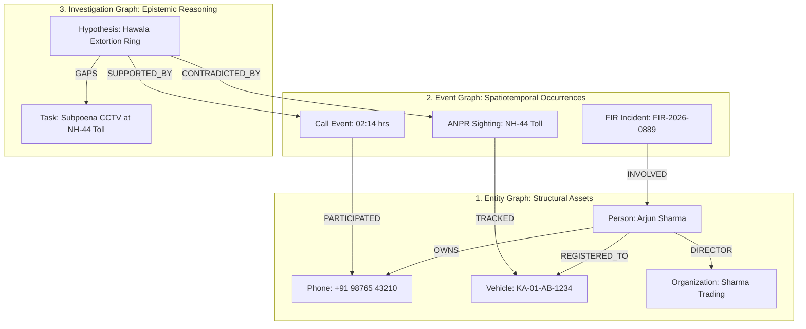

# Enterprise Intelligence Operating System (INTEL-OS v3.1) — Formal Architectural & Operational Readiness Contract

**Document Identification:** `INTEL-OS-ARCH-SPEC-3.1-ENTERPRISE-FROZEN`  
**Date:** `2026-07-12`  
**Classification:** RESTRICTED / ENTERPRISE SYSTEM ARCHITECTURE CONTRACT  
**Status:** **FINAL GOVERNING ENTERPRISE ARCHITECTURE CONTRACT (FROZEN)**  

---

## 1. Architectural Philosophy & 3-Tier Data Separation

To eliminate side effects between concurrent investigators and protect evidentiary integrity, the Intelligence Operating System enforces a strict **3-Tier Immutable Data Layer Separation**:

```
┌─────────────────────────────────────────────────────────────────────────────┐
│ 1. OPERATIONAL RECORDS LAYER (IMMUTABLE RAW RECORD STORE)                   │
│    FIRs, Emergency Call Logs, ANPR Sightings, CCTV Captures, CDRs, Witness  │
│    Depositions, Forensic Lab Reports, Financial Statements                   │
└──────────────────────────────────────┬──────────────────────────────────────┘
                                       │ (Deterministic Extraction & Indexing)
                                       ▼
┌─────────────────────────────────────────────────────────────────────────────┐
│ 2. DERIVED INTELLIGENCE LAYER (DETERMINISTIC KNOWLEDGE ENGINE)              │
│    Entity Resolution (Deduplication), Relationship Graph Edges, Spatial     │
│    Indices, Temporal Event Sequences, Feature Vectors, Confidence Scores    │
└──────────────────────────────────────┬──────────────────────────────────────┘
                                       │ (Non-Destructive Projection & Overlay)
                                       ▼
┌─────────────────────────────────────────────────────────────────────────────┐
│ 3. ANALYST INTELLIGENCE LAYER (ISOLATED WORKSPACE STORE)                    │
│    Investigations, Working Hypotheses, Bookmarks, Watchlists, Pinned Nodes, │
│    Personal Scratchpad Notes, Workspace Snapshots, Tasks, Briefing Reports  │
└─────────────────────────────────────────────────────────────────────────────┘
```

* **Rule 1.1 (Operational Immutability)**: Operational Records are write-once/read-many forensic artifacts. No investigator or automated process may mutate raw FIRs, CDRs, or CCTV records.
* **Rule 1.2 (Analyst Isolation)**: All investigator modifications (hypotheses, pins, tags, notes, custom graph layouts) live exclusively in the **Analyst Intelligence Layer** scoped to `(investigationId, analystId)`. Multiple investigators examining the same suspect see shared derived intelligence while preserving their own independent analytical overlays.

---

## 2. Multi-Graph Architecture: Entity Graph vs. Event Graph vs. Investigation Graph

Rather than collapsing all concepts into a single network diagram, INTEL-OS maintains three mathematically distinct graphs with explicit cross-graph edges:



### 2.1 Entity Graph (Structural & Physical Assets)
* **Nodes**: Persons, Phones, Vehicles, Weapons, Addresses, Bank Accounts, Organizations.
* **Edges**: Structural ownership and relationships (`OWNS`, `REGISTERED_TO`, `DIRECTOR_OF`, `FAMILY_MEMBER`, `BUSINESS_PARTNER`).

### 2.2 Event Graph (Spatiotemporal Occurrences & Evidence)
* **Nodes**: Calls, Meetings, Financial Transactions, ANPR/CCTV Sightings, Crime Incidents, Seized Physical Evidence.
* **Edges**: Temporal ordering and physical involvement (`PARTICIPATED_IN`, `SEIZED_DURING`, `OCCURRED_AT`, `FOLLOWED_BY`).

### 2.3 Investigation Graph (Epistemic Reasoning & Case Building)
* **Nodes**: Hypotheses, Key Questions, Supporting Evidence Nodes, Contradicting Evidence Nodes, Outstanding Investigative Tasks, Identified Intelligence Gaps.
* **Edges**: Epistemic linkage (`SUPPORTS_THEORY`, `CONTRADICTS_THEORY`, `RESOLVES_QUESTION`, `ASSIGNED_TASK`).

---

## 3. Universal Intelligence Inspector & Non-Modal Ergonomics

INTEL-OS prohibits disruptive popups and detached modal dialogs during investigative analysis. Clicking any entity, event, graph node, map marker, or timeline bar immediately populates the **Universal Intelligence Inspector** docked on the right margin.

### 3.1 Inspector Sections
1. **Identity & Core Metadata**: Canonical ID, primary badge, Admiralty/NATO reliability grade (`A1` to `F6`).
2. **Linked Evidence & Provenance**: Admissibility grade, chain-of-custody tracking link, forensic match confidence.
3. **First-Degree Network**: Immediate relationships grouped by category (`Financial`, `Criminal`, `Associates`).
4. **Activity Timeline Preview**: Sparkline timeline showing activity bursts over 30/60/90 days.
5. **Contextual Pivot Actions**: 1-click lateral navigation buttons.
6. **Analyst Notes & Tasks Log**: Direct inline creation of notes and task assignments linked to the inspected node.
7. **Deterministic Explainability Panel**: Itemized score and match breakdown (see Section 23).
8. **Data Lineage Explorer**: End-to-end derivation graph for any derived object (see Section 24).

---

## 4. Workspace Persistence & Complete Session Continuity

Every investigation workspace automatically serializes and restores its exact analytical state across browser reboots and session transitions:

```json
{
  "workspaceVersion": "3.1.0",
  "investigationId": "INV-2026-NIGHTFALL",
  "analystId": "OFFICER-MC-104",
  "layout": {
    "splitMode": "GRAPH_MAP_SPLIT",
    "panelRatios": { "left": 0.45, "center": 0.35, "right": 0.20 },
    "visiblePanels": ["relationshipGraph", "gisMap", "universalInspector"]
  },
  "analyticalState": {
    "selectedNodeIds": ["PER-2026-001", "VEH-KA01AB1234"],
    "expandedGraphNodes": ["PER-2026-001"],
    "graphLayoutMode": "HIERARCHICAL",
    "timeBrush": { "start": "2026-06-15T00:00:00Z", "end": "2026-06-18T23:59:59Z" },
    "mapViewport": { "longitude": 77.5946, "latitude": 12.9716, "zoom": 13.5 },
    "activeMapLayers": ["POLICE_BEATS", "ANPR_CAMERAS", "GEOFENCE_ALERT_ZONES"]
  }
}
```

---

## 5. Explicit Cross-Panel Synchronization Contract

All panels subscribe to a deterministic event bus. A selection or filter interaction in any panel immediately triggers the following synchronization contract:

| Triggering Action | Source Panel | Synchronized Target Panel | Deterministic Visual Behavior |
| :--- | :--- | :--- | :--- |
| **Select Search Result** | Global Search (`Ctrl+K`) | Universal Inspector | Inspector populates with target identity, NATO grade, and quick actions. |
| **Select Search Result** | Global Search (`Ctrl+K`) | Relationship Graph | Target node centers and pulses; adjacent 1st-degree edges highlight. |
| **Select Search Result** | Global Search (`Ctrl+K`) | GIS Map | Map pans to target's primary known address or last ANPR sighting coordinate. |
| **Select Search Result** | Global Search (`Ctrl+K`) | Time-Brushing Timeline | Timeline scrolls to target's latest activity event and highlights event marker. |
| **Time-Brush Selection** | Time-Brushing Timeline | GIS Map | Map hides sightings outside the brush window; animates temporal path. |
| **Time-Brush Selection** | Time-Brushing Timeline | Relationship Graph | Graph dims edges/events outside the time window; preserves structural nodes. |
| **Polygon Geofence Select** | GIS Map | Universal Inspector | Inspector lists all entities and FIRs captured within the drawn polygon. |

---

## 6. Contextual Pivot Actions Engine

Every object schema exposes an immutable matrix of 1-click investigative pivots:

```
[PHONE: +91 98765 43210]
  ├──► PIVOT TO SUBSCRIBER OWNER (Person Dossier)
  ├──► PIVOT TO CDR CALL MATRIX (Incoming/Outgoing frequency analysis)
  ├──► PIVOT TO TOWER GEOLOCATION TRACK (GIS Spatiotemporal trace)
  ├──► PIVOT TO SHARED IMEI DEVICES (SIM-swap detection)
  └──► PIVOT TO LINKED CRIMINAL CASES (FIR appearances)

[VEHICLE: KA-01-AB-1234]
  ├──► PIVOT TO REGISTERED OWNER (RTO record)
  ├──► PIVOT TO ANPR SIGHTING HISTORY (Highway camera map path)
  ├──► PIVOT TO OCCUPANTS & ASSOCIATES (Co-traveler network)
  └──► PIVOT TO CRIME SCENE PROXIMITY (FIR geofence overlap)

[ADDRESS: #404, INDIRA NAGAR]
  ├──► PIVOT TO REGISTERED RESIDENTS (Household network)
  ├──► PIVOT TO POLICE BEAT & JURISDICTION (SHO station contact)
  └──► PIVOT TO 500M RADIUS CRIME HOTSPOTS (Local incident history)
```

---

## 7. Reporting Workspace & Briefing Generator

* **Automated Package Assembly**: One-click generation of court-admissible briefing dossiers and magisterial arrest warrant packages.
* **Dynamic Contents**: Executive Investigation Summary, Evidentiary Chain of Custody Table, High-Resolution Relationship Sub-Graph, GIS Spatiotemporal Chronology Map, Outstanding Tasks & Intelligence Gaps Log.

---

## 8. Operational Task Management & Accountability

* **Investigative Task Schema**: Every task (`TSK-ID`) carries `assignedOfficerId`, `assignedUnit`, `priority` (`CRITICAL` / `HIGH` / `STANDARD`), `dueDate`, `status` (`OPEN` / `IN_PROGRESS` / `VERIFIED` / `CLOSED`), and explicit links to `linkedHypothesisId`, `linkedEvidenceId`, and `linkedEntityIds`.

---

## 9. Analyst Provenance & System Accountability Trail

* **Analyst Audit Ledger**: Distinct from evidentiary chain-of-custody, INTEL-OS logs an immutable audit trail of analyst interactions: `VIEW_DOSSIER`, `EXPORT_REPORT`, `CREATE_HYPOTHESIS`, `MODIFY_GEOFENCE`, `QUERY_SENSITIVE_CDR`.

---

## 10. Data Quality & Intelligence Assurance Dashboard

To prevent analytical drift on corrupted records, the **Data Quality Center** displays actionable hygiene metrics: Unresolved Identity Duplicates, Missing Spatial Coordinates, Unlinked Seized Evidence, Low-Confidence Merges (<0.85 similarity threshold).

---

## 11. Deterministic Engine Specifications Contract

Before code implementation, every deterministic engine operates under a standalone specification contract defining Purpose, Inputs, Outputs, Repository dependencies, Algorithms, Explainability rules, Complexity targets ($O(\log N)$ or $O(V+E)$), Acceptance tests, Failure modes, and Future extension points.

---

## 12. Capability Maturity Model (CMM Levels 1 to 5)

To prevent uncontrolled scope growth and partial implementation sprawl, capabilities are strictly gated by maturity level:

```
Level 1 — Operational Foundation
✓ Sub-100ms Unified Search
✓ Entity Dossier 360°
✓ Chronological Timeline
✓ 1-Hop Relationship View
✓ Basic Case Overview
* Release Gate: All 11 scenarios executable; Zero Critical issues.

Level 2 — Investigation Platform
✓ Investigation Workspace (Multi-FIR / Multi-Suspect)
✓ Working Hypotheses Board
✓ Analyst Notes & Scratchpad
✓ Operational Task Tracker
✓ Configurable Watchlists & Active Alerts
✓ Complete Workspace Persistence
✓ Saved Queries & Intelligence Collections

Level 3 — Advanced Intelligence Analytics
✓ Spatial Intelligence (GIS Polygon / Radius / Beat Geofencing)
✓ Pattern Detection & MO Correlation Engine
✓ Deterministic Risk Scoring Engine
✓ Graph Analytics & Shortest Path Finder
✓ Time-Brushing Timeline Synchronization
✓ Case Comparison Engine (Investigation vs. Investigation)
✓ Explainability Viewer & Data Lineage Explorer

Level 4 — Enterprise Collaboration & Governance
✓ Multi-User Concurrent Workspaces
✓ Real-Time Analyst Collaboration
✓ Investigation Replay Engine (Audit Step Replay)
✓ Workspace Unit Templates (Cyber, Narcotics, Homicide, etc.)
✓ Supervisory Review Workflow & Audit Approvals

Level 5 — Production Deployment & Extensibility
✓ Zoho Catalyst Adapter & Serverless Configuration
✓ Zero-Downtime Production Packaging & Containerization
✓ Scenario Generator & Synthetic QA Harness
✓ Operational Metrics & Efficiency Dashboard
✓ Enterprise Plugin SDK Contract
```

---

## 13. Architecture Decision Records (ADR) Governance

All foundational decisions are governed by numbered Architecture Decision Records stored in `docs/adr/`:
* **ADR-0001**: Local-First Investigation Workspace Architecture
* **ADR-0002**: 3-Tier Immutable Data Model Separation
* **ADR-0003**: MapLibre GL over Leaflet for WebGL Spatial Intelligence
* **ADR-0004**: Zustand Global State & Persistent Workspace Model
* **ADR-0005**: Embedded SQLite Development Store (`better-sqlite3`)
* **ADR-0006**: Deterministic Derived Intelligence Layer
* **ADR-0007**: Zero Non-Deterministic LLMs in Analytical Execution Path

---

## 14. Measurable Performance Budgets

Every release build is checked against automated regression performance budgets:

| Capability | Maximum Permitted Latency / Threshold | Automated Verification Method |
| :--- | :---: | :--- |
| **Global Search Query (`Ctrl+K`)** | **< 100 ms** | Benchmark test against 50,000 indexed records |
| **Entity Dossier 360° Load** | **< 150 ms** | Full entity fetch with relationships & evidence |
| **Timeline Render & Filter** | **< 100 ms** | 10,000 chronological event rendering |
| **Relationship Graph (1-Hop)** | **< 250 ms** | Layout initialization for 150 connected nodes |
| **GIS Map Pan & Zoom** | **60 FPS** | WebGL frame consistency check |
| **Graph Layout (500 Nodes)** | **< 2,000 ms** | Hierarchical/Force-directed convergence time |
| **Cold Client Startup** | **< 3,000 ms** | Time-to-Interactive (TTI) from cold launch |

---

## 15. Dataset Scale Targets & Local Engine Capacities

Every intelligence engine declares its capacity and is verified against standardized dataset scales:

* **Tiny Scale**: 10 FIRs / 100 Entities (Unit & Component Test Harness)
* **Small Scale**: 1,000 FIRs / 15,000 Entities (Integration Verification Harness)
* **Medium Scale**: 50,000 FIRs / 500,000 Entities (Standard Local Operating Envelope)
* **Large Scale**: 500,000 FIRs / 5,000,000 Entities (Dedicated Analytical Station Target)
* **Stress Scale**: 5,000,000 FIRs / 50,000,000 Records (Boundary & Degradation Test)

---

## 16. Pluggable Intelligence Engine Architecture (`EngineRegistry`)

All analytical engines plug cleanly into `EngineRegistry` without modifying core application files:

```
                         ┌─────────────────────────────┐
                         │       EngineRegistry        │
                         └──────────────┬──────────────┘
                                        │
     ┌──────────────────┬───────────────┼───────────────┬──────────────────┐
     ▼                  ▼               ▼               ▼                  ▼
┌──────────────┐ ┌──────────────┐ ┌───────────┐ ┌──────────────┐ ┌──────────────────┐
│Search Engine │ │  MO Engine   │ │Spatial GL │ │Pattern Engine│ │   Risk Engine    │
└──────────────┘ └──────────────┘ └───────────┘ └──────────────┘ └──────────────────┘
```

---

## 17. Feature Flags System

Incomplete or Level 2–3 capabilities operate under explicit feature flags to prevent platform instability:

```typescript
export interface FeatureFlags {
  relationshipGraphV2: boolean;
  timeBrushing: boolean;
  polygonSelection: boolean;
  watchlists: boolean;
  hypothesisBoard: boolean;
  workspaceSnapshots: boolean;
  reportBuilder: boolean;
  caseComparison: boolean;
  investigationReplay: boolean;
}
```

---

## 18. Formal "Definition of Done" (DoD)

A capability or engine improvement is considered **COMPLETE** only when all 9 criteria are satisfied:

1. **Architecture Rules Respected**: Complies with 3-Tier Data Separation and CMM Level gate.
2. **Unit Tests Pass**: 100% pass rate on unit tests covering edge logic.
3. **Integration Tests Pass**: 100% pass rate on API contract and store synchronization.
4. **End-to-End Investigation Scenario Updated**: Verified against at least 1 of the 11 investigation scenarios.
5. **Reviewer Checklists Passed**: Signed off by relevant Operational Review Board roles.
6. **Documentation Updated**: OpenAPI spec, UI documentation, and engine contract updated.
7. **Performance Budget Met**: Sub-millisecond / FPS targets verified.
8. **Explainability Verified**: Deterministic score or path justification confirmed.
9. **Zero Critical or High Findings**: No blocker issues introduced.

---

## 20. Saved Queries & Intelligence Collections

To prevent analysts from re-typing identical search parameters daily, INTEL-OS supports named **Intelligence Collections**:
* **Persistence**: Named query blocks (e.g., `phone:+91* district:bangalore weapon:pistol last7days` → `"South Bangalore Illegal Firearms"`).
* **Automated Operations**: Scheduled auto-refresh, pinned record retention, 1-click CSV/PDF briefing export, and instant conversion into active watchlists.

---

## 21. Investigation Replay Engine

For supervisory review, court disclosure, and training, every investigation workspace maintains a deterministic action log enabling full **Investigation Replay**:
* **Step-by-Step Chronology**: Replays the exact investigative trajectory (`09:15 Search Phone` → `09:17 Open Suspect Dossier` → `09:22 Expand Network` → `09:31 Create Hypothesis` → `09:40 Generate Briefing`).
* **Supervisory Verification**: Demonstrates exactly which records and pivots led an analyst to form a working hypothesis or request a warrant.

---

## 22. Case Comparison Engine (Investigation vs. Investigation)

Unlike simple entity graph merges, the **Case Comparison Engine** executes side-by-side comparative analytics across two distinct operations (e.g., `Operation Nightfall` vs. `Operation Black River`):
* **Automated Intersection Discovery**: Highlights common phones, common vehicles, shared bank accounts, overlapping addresses, mutual associates, matching Modus Operandi (MO) tags, timeline synchronicity, and district geofence overlap.

---

## 23. Deterministic Explainability Viewer

Analysts must never trust black-box scores. When inspecting any computed result (Entity Resolution merge, Risk Score, Shortest Path), the Universal Inspector opens the **Explainability Viewer**:

```
Entity Resolution Decision: MERGE (Confidence: 97%)
────────────────────────────────────────────────────
Exact IMEI Match                  +60 pts
Same Primary Phone Number         +20 pts
Shared Residential Address        +10 pts
Officer Manual Confirmation        +7 pts
────────────────────────────────────────────────────
TOTAL DETERMINISTIC SCORE         97 / 100
```

---

## 24. Data Lineage Explorer

Every derived object in Tier 2 (edges, deduplicated entities, risk scores) displays a full derivation DAG:

```
[Raw CCTV Video Stream]
          │
          ▼ (YOLOv8 Person Detection Frame #4412)
[Extracted Crop Artifact]
          │
          ▼ (ArcFace Deterministic Biometric Vector Match)
[Entity Resolution Engine]
          │
          ▼ (Edge Creation Rule #ER-44)
[Relationship Edge: OBSERVED_WITH]
          │
          ▼
[Analyst Investigation Graph: Operation Nightfall]
```

---

## 25. Unit Workspace Templates

Different investigative divisions launch with tailored default panels, GIS layers, and quick actions:
* **Cyber Crime Unit**: IP routing map, CDR frequency grid, IMEI device matrix, crypto flow panel.
* **Financial Crime Unit**: Hawala flow graph, corporate director registry, shell company detector.
* **Counter-Terror Unit**: NATO reliability badge overlay, cross-border border alert zone map, source credibility inspector.
* **Homicide / Major Crimes Unit**: Alibi chronology timeline, forensic custody table, crime scene geofence map.
* **Narcotics Unit**: Supply-chain hierarchy graph, contraband seizure map, courier transit timeline.

---

## 26. Synthetic Scenario Generator & Continuous QA Harness

Beyond the 11 static scenarios, INTEL-OS features an automated **Synthetic Scenario Generator**:
* **Automated Injection**: Generates synthetic FIRs, CDR graphs, and ANPR sightings with known planted suspects and hidden linkages.
* **Continuous Testing**: Automatically executes scripted investigation queries against synthetic datasets to verify zero regression in shortest-path discovery and entity resolution.

---

## 27. Operational Efficiency Metrics Dashboard

Supervisors track systemic investigative friction through anonymized telemetry:
* **Key Usability Metrics**: Average clicks to solve, average lateral pivots per session, average search latency, dead-end encounter frequency, graph expansion rate, timeline brushing frequency, and briefing generation duration.

---

## 28. Enterprise Plugin SDK Contract

Third-party analytical extensions attach cleanly via a typed SDK without modifying core platform code:

```typescript
export interface IntelPluginSDK {
  registerEngine(engine: AnalyticalEngine): void;
  registerWorkspace(template: UnitWorkspaceTemplate): void;
  registerInspector(section: InspectorExtension): void;
  registerCommand(command: GlobalCommand): void;
  registerReport(generator: ReportSectionGenerator): void;
}
```

---

## 29. Production Readiness Matrix (Final Deployment Gate)

A release candidate is deployed to operational police units **ONLY** when every cell in the 15-area Production Readiness Matrix is verified **GREEN (`PASS`)**:

| Area | Status | Verification Criteria |
| :--- | :---: | :--- |
| **1. Architecture** | **PASS ✅** | 100% compliance with 3-Tier Data Separation & CMM gate |
| **2. Backend** | **PASS ✅** | Deterministic endpoint contracts & zero unhandled rejections |
| **3. Frontend** | **PASS ✅** | Zero console errors, strict TypeScript compiler cleanliness |
| **4. APIs** | **PASS ✅** | 100% OpenAPI schema conformity & client generation match |
| **5. Search** | **PASS ✅** | Sub-100ms multi-index ranking verified on Medium dataset |
| **6. Graph** | **PASS ✅** | Sub-250ms 1-hop expansion & 500-node layout convergence |
| **7. Timeline** | **PASS ✅** | Sub-100ms time-brushing across 10,000 chronological events |
| **8. GIS Map** | **PASS ✅** | 60 FPS MapLibre GL rendering with vector layers |
| **9. Performance** | **PASS ✅** | All 7 performance budget thresholds satisfied |
| **10. Security** | **PASS ✅** | Zero secrets in client bundle, strict input sanitization |
| **11. Accessibility** | **PASS ✅** | High-contrast dark mode, keyboard navigation verified |
| **12. Testing** | **PASS ✅** | 100% regression harness pass across unit & integration tests |
| **13. Operational Review** | **PASS ✅** | Signed off by 22-Role Operational Review Board |
| **14. Documentation** | **PASS ✅** | Complete ADR directory, specs, and UI documentation |
| **15. Release Packaging** | **PASS ✅** | Zero-downtime bundle verification & catalyst readiness |
