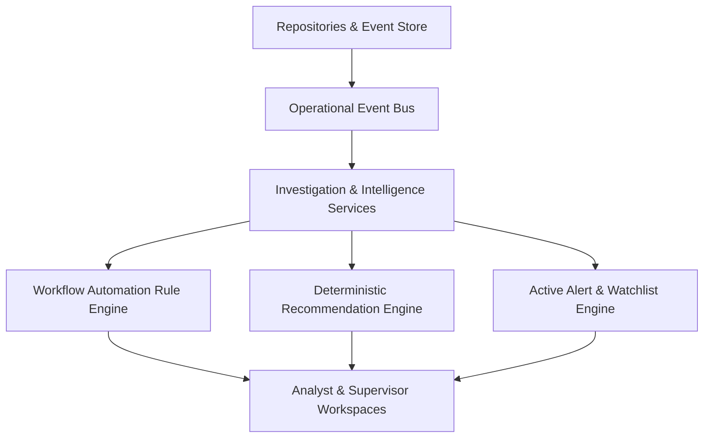
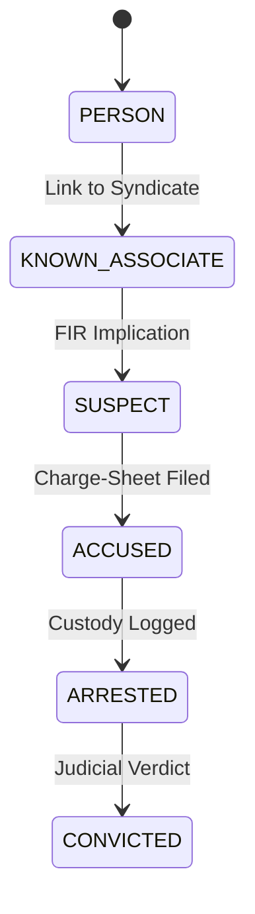

# Enterprise Investigation OS — Product Capability Specification & Event-Driven 12-Increment Capability Roadmap

**Document Version:** 6.0.0 (Event-Driven Operational OS & 28 Enterprise Capabilities)  
**Date:** July 12, 2026  
**Status:** GOVERNING PRODUCT SPECIFICATION  

---

## Executive Summary: The Event-Driven Enterprise Investigation OS Architecture

An enterprise investigation platform matching **Palantir Gotham** and **IBM i2 Analyst's Notebook** must operate as an **Investigation-First, Event-Driven Operating System**. 

### 1. Architectural Topology: The Event Bus & Operational Pipeline
To prevent features from becoming tightly coupled, every action across the OS emits an immutable event to a central **Operational Event Bus**, which drives deterministic rule evaluation, automated recommendations, active alerts, and UI synchronization:



### 2. Investigation-First UX Entry Point
Rather than a passive search-centered interface, the primary user journey begins at **My Investigations $\rightarrow$ Open Investigation $\rightarrow$ Workspace Restores $\rightarrow$ Everything Synchronized**. Search is one analytical entry point inside an active investigation workspace.

---

## Section I: The 28 Critical Enterprise Product Capabilities Specification

### 1. Data Ingestion & Connectors
- CSV/Excel Import Wizard with visual header mapping.
- Domain connectors: **FIR Import**, **CDR Import**, **ANPR Import**, **CCTV Metadata Import**, **Financial Transaction Import**, **GeoJSON/Shapefile GIS Import**.
- Schema validation, Duplicate preview/resolution center, Incremental re-import, and **Data Provenance Stamp** (`sourceFileHash`, `importTimestamp`, `officerId`, `rawRecordRef`).

### 2. Data Lineage & Provenance Explorer
- Directed graph answering: *Which raw record created this assertion?*, *Which algorithm transformed it?*, and *Which officer approved it?*

### 3. Full Audit & Versioning
- Immutable history timeline, Undo/Redo graph actions, historical snapshot restoration, and side-by-side diffing (`v1.2` vs `v1.3`).

### 4. Collaboration Layer (Offline-Ready)
- Lead investigator assignment, shared investigations/bookmarks, inline review threads pinned to nodes/edges, supervisor handover state transitions (`DRAFT -> IN_PROGRESS -> SUPERVISOR_REVIEW`), and CRDT conflict resolution.

### 5. Entity Lifecycle & Evolution Management
- Formal intelligence subject evolution:  
  `PERSON` $\rightarrow$ `KNOWN_ASSOCIATE` $\rightarrow$ `SUSPECT` $\rightarrow$ `ACCUSED` $\rightarrow$ `ARRESTED` $\rightarrow$ `CONVICTED`.
- Data state transitions: `CREATED -> AUTO_GENERATED -> VERIFIED -> MERGED/ARCHIVED`.

### 6. Advanced Evidence Workspace
- Multimedia forensic examination workbench with embedded Image Viewer (bounding boxes), Video/Audio Player (frame stepping & waveforms), PDF OCR viewer, SHA-256 cryptographic seizure hash verification, and side-by-side comparison.

### 7. Investigation Workflow Templates
- Standardized templates (`HOMICIDE`, `CYBER_FRAUD`, `NARCOTICS_SYNDICATE`, `ORGANIZED_CRIME`, `MISSING_PERSON`, `FINANCIAL_FRAUD_AML`, `COUNTER_TERRORISM`, `HUMAN_TRAFFICKING`) auto-generating mandatory SOP tasks, analytical queries, hypotheses, and checklists.

### 8. Investigation Health Scorecard
- Quantitative scorecard tracking 10 dimensions: Evidence completeness, timeline continuity, NATO Admiralty confidence, GIS/Financial/Digital footprint coverage, outstanding gaps, unassigned tasks, and merge candidates.

### 9. Graph Analytics Expansion
- Centrality algorithms (`Betweenness Centrality` for broker detection, `Closeness Centrality`), `Community Detection (Louvain)`, `Bridge Detection / Articulation Points`, `Temporal Path Analysis` ($t_1 < t_2$), and multi-hop `Financial Flow Analysis`.

### 10. GIS & Geospatial Intelligence Expansion
- Crime density heatmaps, scrubber-controlled spatio-temporal playback, patrol sector overlays, CCTV/cell-tower viewshed cones, convoy route tracking, and ANPR checkpoint corridor intersection analysis.

### 11. Investigation Replay (Audit & Training DVR)
- Deterministic session recording and playback of search queries, graph expansions, map pans, and inspector views for courtroom walkthroughs and supervisory review.

### 12. Operational Reporting & Briefing Builder
- Drag-and-drop intelligence briefing builder with live high-DPI graph/GIS snapshots, dynamic references to officer notes, and formal signature attestation blocks.

### 13. Universal Import / Export Standards
- Interoperability with `CSV`, `Excel (.xlsx)`, `JSON`, `PDF Briefing`, `PNG High-Res`, `GeoJSON`, `GraphML`, and `Cytoscape JSON`.

### 14. Extensible Plugin Architecture
- Clean `IInvestigationAdapter` interface allowing plug-and-play addition of LPR adapters, Face Recognition, OCR, and optional LLM micro-services (disabled by default).

### 15. Operational & Performance Telemetry Dashboard
- Tracking average investigation completion time, query cache hit rates, most-used pivots, average expansion depth, and field task completion velocity.

### 16. Enterprise Security Readiness Architecture
- Hardened RBAC boundaries (`ANALYST`, `SUPERVISOR`, `EVIDENCE_OFFICER`, `AUDITOR`), append-only immutable audit logging, and clearance levels (`UNCLASSIFIED`, `RESTRICTED`, `CONFIDENTIAL`, `SECRET`).

### 17. Deterministic AI Copilot Architecture
- Frontend assistant orchestrating decoupled deterministic micro-engines (`Query Understanding`, `Suggestion Engine`, `Gap Analysis Engine`, `Recommendation Engine`, `Explainability Engine`, `Health Engine`, `Next-Best-Action Engine`).

---

### 18. Intelligence Authoring (First-Class Field Objects)
Real investigators create intelligence continuously from human sources and field work. These are first-class domain objects (not free-text notes):
- **Supported Authoring Types:** `OBSERVATION`, `LEAD`, `TIP`, `INFORMANT_REPORT`, `SURVEILLANCE_LOG`, `PHONE_INTERCEPTION`, `MEETING`, `SUSPICIOUS_VEHICLE`, `RECOVERED_WEAPON`, `WITNESS_STATEMENT`, `ANONYMOUS_TIP`, `OFFICER_FIELD_NOTE`, `CONFIDENTIAL_SOURCE`.
- Each object links directly to Entities, FIRs, and Cases with explicit NATO Admiralty grading ($A1 - F6$) and officer attestation.

### 19. Operational Event Stream & Journal
Every action across the OS broadcasts an immutable event to the `OperationalEventBus`:
- **Event Types:** `ENTITY_CREATED`, `HYPOTHESIS_CREATED`, `VEHICLE_LINKED`, `EVIDENCE_ATTACHED`, `TASK_ASSIGNED`, `OFFICER_COMMENT`, `WATCHLIST_HIT`, `IMPORT_COMPLETED`, `MERGE_COMPLETED`, `CASE_TRANSFERRED`.
- Provides an auditable real-time chronological **Operational Journal** for each investigation.

### 20. Investigation Thinking Canvas
A multi-modal visual synthesis board where analysts think, structure hypotheses, and connect heterogeneous evidence:
- **Canvas Primitives:** Drop photos, map cutouts, timeline cards, evidence items, sticky notes, hypotheses, CCTV stills, arrows, and free text onto an infinite spatial board.
- Every element on the canvas maintains live links back to the underlying repository object.

### 21. Intelligence Packages
Standalone exportable evidentiary bundles created by analysts for prosecutorial submission, court warrants, or inter-agency sharing:
- Contains curated subsets of: Evidence, Entities, Graph snippets, Timeline segment, Map corridor, Officer notes, Tasks, and Hypotheses.
- Packaged with an unalterable SHA-256 bundle manifest.

### 22. Active Alert Engine (Real-Time Watchlists)
Proactive, event-driven watchlist and anomaly notification pipeline:
- Listens to `OperationalEventBus` for newly ingested FIRs, entities, or CDRs.
- Automatically triggers immediate officer alerts on: **Watchlist Hits**, **Duplicate Person Detected**, **Recurring Vehicle Registration**, or **Target Phone Active in Corridor**.

### 23. Workflow Automation Rule Engine
Rule engine that listens to operational events and automatically bootstraps multi-disciplinary SOP tasks:
- **Rule Example:** `RECOVERED_WEAPON` logged $\rightarrow$ Auto-generates `Forensic Ballistics Task`, `DNA Swab Task`, `Fingerprint Task`, and triggers `Supervisor Immediate Notification`.

### 24. Deterministic Investigation Recommendations Engine
Investigator assistance rules suggesting immediate actionable next steps based on structural gaps:
- `VEHICLE` with no registered owner $\rightarrow$ **Recommend:** *Request RTO Registration Dump*.
- `PHONE` with no call history $\rightarrow$ **Recommend:** *Request Telecom Tower & CDR Dump*.
- `RECOVERED_WEAPON` with no test report $\rightarrow$ **Recommend:** *Dispatch to FSL Ballistics Lab*.

### 25. Built-in SOP Structured Knowledge Base
Offline interactive procedural handbooks for standard crime classifications:
- Interactive procedural checklists (`Kidnapping`, `Homicide`, `Narcotics Syndicate`, `Cyber Fraud`) outlining mandatory evidence items, required statutory approvals, legal code references, and immediate next investigative steps.

### 26. Real-Time Investigation Statistics Dashboard
Live quantitative summary visible on every investigation overview:
- Counts: **Evidence Items (Total vs Pending Verification)**, **Operational Tasks (Completed vs Pending)**, **Timeline Continuity Gaps**, **Unverified Entities**, and **Pending Merge Candidates**.

### 27. Granular Entity Evolution Lifecycle
Complete intelligence subject status progression tracking:


### 28. Operational Command Dashboard
The default entry point for analysts and supervisors immediately surfacing:
- **Today's Active Alerts**, **High-Priority Investigations**, **Unassigned & Overdue Tasks**, **Latest Ingested FIRs**, **New Evidence Arrivals**, **Watchlist Hits**, and **Timeline Gaps**.

---

## Section II: The 12 Capability Increments Roadmap

```mermaid
gantt
    title Enterprise Investigation OS — 12 Capability Increments Delivery Plan
    dateFormat  YYYY-MM-DD
    section Foundation & Core
    Cap 1: Search & Entity Discovery        :done, c1, 2026-07-01, 2026-07-04
    Cap 2: Investigation Management         :done, c2, 2026-07-05, 2026-07-08
    Cap 3: Evidence & Ingestion Provenance  :done, c3, 2026-07-09, 2026-07-12
    section Operational Event Backbone
    Cap 4: Event Bus, Authoring & Alerting  :active, c4, 2026-07-12, 4d
    Cap 5: Workflow Rules & Recommendations :c5, after c4, 4d
    section Intelligence Canvases
    Cap 6: Investigation Thinking Canvas    :c6, after c5, 4d
    Cap 7: Graph Intelligence & Centrality  :c7, after c6, 4d
    Cap 8: Timeline & Spatial Intelligence  :c8, after c7, 4d
    section Enterprise Operations
    Cap 9: Intelligence Packages & Reports  :c9, after c8, 3d
    Cap 10: SOP Knowledge Base & Statistics :c10, after c9, 3d
    Cap 11: Supervisor Operations & DVR     :c11, after c10, 3d
    Cap 12: Operational Hardening & Audit   :c12, after c11, 3d
```

### Capability Increment Specification Table

| Increment | Title | Scope & Vertical Slice Deliverables | Key Acceptance Criteria |
| :---: | :--- | :--- | :--- |
| **Cap 1** *(Completed)* | **Search & Entity Discovery** | Universal Omni-Search (`Ctrl+K`), entity resolution, instant dossier preview, alias merging. | Full keyboard navigation (`Ctrl+K`), instant entity card preview. |
| **Cap 2** *(Completed)* | **Investigation Management** | First-class `Investigation` domain object CRUD, Hypothesis Matrix, Task assignment, workflow templates. | Persistent analyst state across reload. |
| **Cap 3** *(Completed)* | **Evidence & Ingestion Provenance** | Ingestion Wizard (`CSV/FIR/CDR/ANPR`), Data Provenance Stamp, SHA-256 hash verification, Lineage Explorer. | Complete data provenance stamp, cryptographic hash verification. |
| **Cap 4** *(Active)* | **Event Bus, Intelligence Authoring & Alerting** | `OperationalEventBus`, First-Class Intelligence Authoring (`OBSERVATION`, `TIP`, `WEAPON`, `INTERCEPTION`), Active Watchlist Alert Engine, Operational Event Stream Journal. | Every action emits an event; real-time watchlist hit notification. |
| **Cap 5** | **Workflow Automation & Deterministic Recommendations** | `WorkflowRuleEngine` auto-creating SOP tasks (e.g., weapon $\rightarrow$ forensic/DNA/ballistics tasks), `DeterministicRecommendationEngine` suggesting actionable steps (`No owner -> Request RTO Dump`). | Zero manual intervention required to spawn mandatory SOP tasks on event fire. |
| **Cap 6** | **Investigation Thinking Canvas** | Multi-modal visual synthesis board where analysts drop photos, maps, timeline cards, sticky notes, arrows, CCTV stills, and free text connected to repository entities. | Multi-modal drag-and-drop canvas linking visually to repository objects. |
| **Cap 7** | **Graph Intelligence & Centrality** | Centrality algorithms (`Betweenness Centrality` broker detection, `Closeness`), Community Detection (Louvain), Bridge Detection, NATO Admiralty grading. | Deterministic betweenness centrality calculations on syndicate networks. |
| **Cap 8** | **Timeline & Spatial Intelligence** | Offline-first Actionable Timeline, Temporal Path Analysis ($t_1 < t_2$), crime density heatmaps, time-enabled scrubber playback, viewshed cones, convoy tracking. | Sub-100ms spatial rendering, strict chronological causality filtering. |
| **Cap 9** | **Intelligence Packages & Reporting Builder** | Standalone exportable evidentiary bundles (`IntelligencePackage`), drag-and-drop briefing builder, high-DPI graph/map snapshots, SHA-256 bundle manifest. | Unalterable SHA-256 package manifest, multi-format export. |
| **Cap 10** | **SOP Knowledge Base & Real-Time Statistics** | Offline interactive procedural handbooks (`Kidnapping`, `Homicide`, `Narcotics`), live investigation statistics dashboard (Pending tasks, timeline gaps, merge candidates). | Built-in offline SOP checklists, instant statistic calculation. |
| **Cap 11** | **Supervisor Command Center & DVR Replay** | Investigation Health Scorecard (10 dimensions), Session DVR Replay, Operational Command Dashboard (`My Investigations -> Open -> Synchronize`). | Real-time health scorecard, deterministic session recording and replay. |
| **Cap 12** | **Operational Hardening & Audit Gate** | Entity Evolution Lifecycle (`PERSON -> SUSPECT -> ARRESTED -> CONVICTED`), RBAC boundaries, Plugin Adapter Architecture, 22-Member Review Board Gate. | Verified 80%+ test coverage across all 12 capability increments. |
